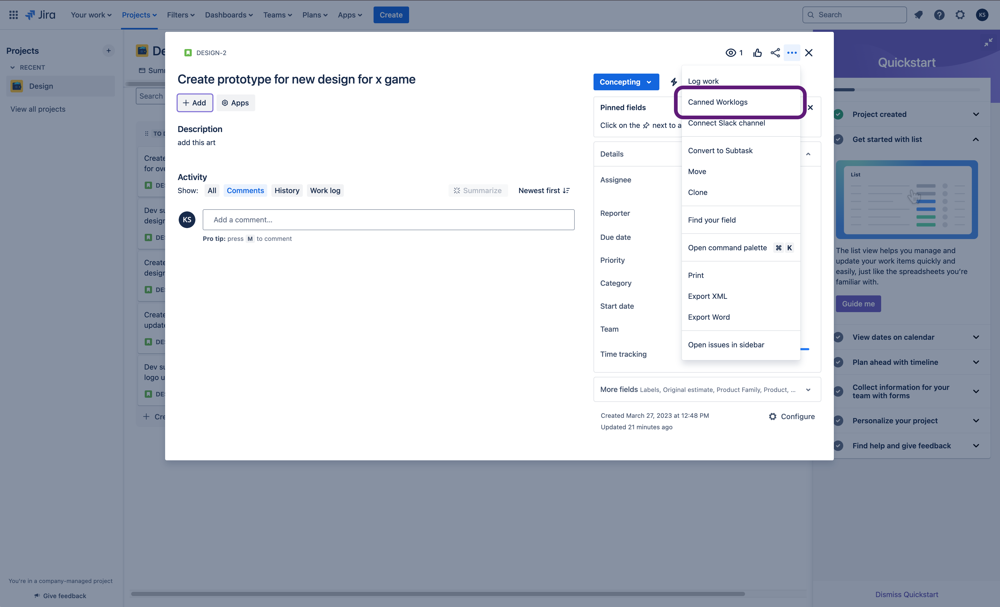

# ▮ Canned Worklogs

**Save time and ensure consistency with reusable worklog templates for your recurring tasks.**

## Overview
Canned Worklogs allows teams to efficiently manage time tracking in Jira by creating a library of reusable worklog templates. Simplify the process of logging work on recurring tasks while ensuring accuracy and consistency.

With customizable placeholders, timestamps, and dynamic links, you can quickly adapt templates to suit specific needs without repetitive manual entries.

---

## Key Features
- **Reusable Worklog Templates**
  Create and store worklog templates for tasks that occur frequently, saving valuable time and reducing manual effort.

- **Consistency Across Teams**
  Standardize how work is logged across the team, minimizing discrepancies and improving reporting accuracy.

- **Adaptable and Easy to Use**
  Templates are fully customizable to fit your project's unique requirements, making worklog entries fast and flexible.

---

## Benefits
- **Save Time**: Eliminate the repetitive process of manually entering worklogs for recurring tasks.
- **Enhance Team Collaboration**: Share templates across teams for uniform reporting.

---

## How It Works
1. **Create Worklog Templates**
   - Navigate to the **Canned Worklogs** section in Jira.
   - Click **Create Template**.
   - Add a template name and customize the Time spent and Worklog comment.

2. **Apply a Template**
   - When logging work on a Jira issue, select an existing template from the library.
   - Review and make any final adjustments before submitting the worklog.

3. **Manage Templates**
   - Edit, delete, or share templates to ensure they remain up-to-date and useful for you.

---

## Example Template
Here's a sample template for a recurring standup meeting task:

**Standup Meeting - Daily**

```
- Name: Standup Meeting - Daily
- Duration: 15m
- Comment: Discussed updates and blockers with the team
```

---

## Getting Started
1. Install **Canned Worklogs** from the Atlassian Marketplace.
2. Access the app via the Jira Issue Actions menu.
3. Start building your library of templates.

 

---

## Support
For assistance, contact our support team at [https://kaisersoftapps.atlassian.net/servicedesk/customer/portal/1](https://kaisersoftapps.atlassian.net/servicedesk/customer/portal/1).

---

## About
Canned Worklogs is designed to make time logging simple, efficient, and accurate for teams using Jira Cloud. Maximize productivity by focusing less on repetitive tasks and more on delivering results.

**Get started today and simplify your worklog process!**
