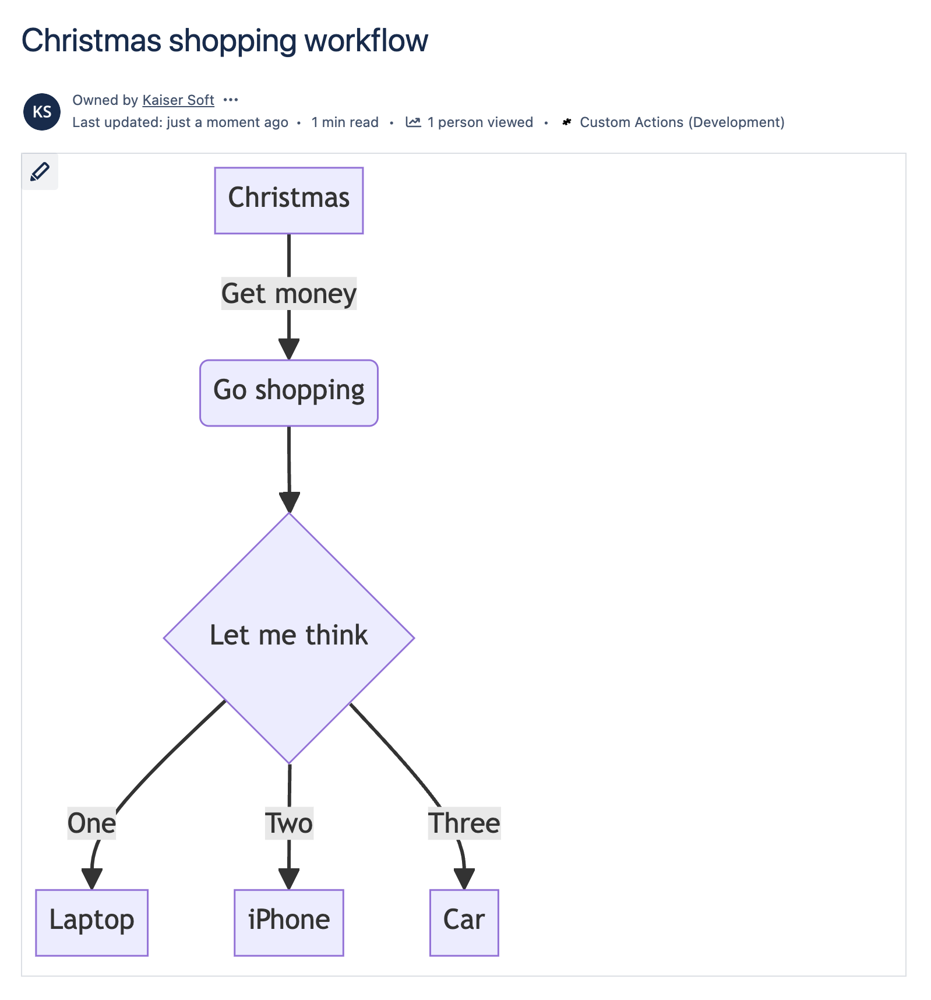

# ▮ ContentCraft: Mermaid diagrams for Confluence and Jira

## Overview

|  | [ContentCraft: Mermaid diagrams for Confluence](https://marketplace.atlassian.com/apps/1235105) and [ContentCraft: Mermaid diagrams for Jira](https://marketplace.atlassian.com/apps/1235178) are powerful apps that provide a "Mermaid Diagram" viewer and editor, allowing users to effortlessly create and render diagrams using Mermaid syntax directly within Atlassian Cloud instances. These tools are perfect for visually representing complex information such as flowcharts, sequence diagrams, Gantt charts, and more. By integrating Mermaid syntax, users can enhance their documentation with visually appealing and easy-to-understand diagrams, making Confluence pages or Jira issues more dynamic and informative. These apps are ideal for teams looking to improve their communication and documentation through clear and concise visual representations. |
|---|:---|

### Who is this app for?

This app is designed for teams and individuals using Confluence Cloud or Jira Cloud who want to easily create and embed visually appealing diagrams using Mermaid syntax. It enhances documentation and communication by providing clear, visual representations of information.

## Installation and Configuration

Install the app from the Atlassian Marketplace:

-  [ContentCraft: Mermaid diagrams for Confluence](https://marketplace.atlassian.com/apps/1235105)
-  [ContentCraft: Mermaid diagrams for Jira](https://marketplace.atlassian.com/apps/1235178)

To use the app:

import Tabs from '@theme/Tabs';
import TabItem from '@theme/TabItem';
import ReactPlayer from 'react-player'

<Tabs>
  <TabItem value="jira" label="In Jira version" default>
    - Open any Jira issue
    - Enable "Diagrams" panel

    <ReactPlayer controls width='100%' url='https://www.youtube.com/watch?v=pX7ML3Ikxuo' />
  </TabItem>
  <TabItem value="conf" label="In Confluence version">
    - Open any Confluence page
    - Insert "Mermaid Diagram" macro

    <ReactPlayer controls width='100%' url='https://www.youtube.com/watch?v=4DJH-C6wJlg' />
  </TabItem>
</Tabs>

## Features Overview

The "ContentCraft" app allows you to create and display various types of diagrams directly on Confluence pages or Jira issues using Mermaid syntax. With support for flowcharts, sequence diagrams, Gantt charts, and more, this app makes it easy to visualize complex information. It integrates seamlessly into your Atlassian Cloud application, enabling dynamic, interactive diagrams that enhance your team's documentation and collaboration.

Full list of supported diagram types:
- [Flowchart](./mermaid-syntax/flowcharts.md)
- [Sequence Diagram](./mermaid-syntax/sequence-diagrams.md)
- [Class Diagram](./mermaid-syntax/class-diagrams.md)
- [State Diagram](./mermaid-syntax/state-diagrams.md)
- [Entity Relationship Diagram](./mermaid-syntax/entity-relationship-diagrams.md)
- [User Journey](./mermaid-syntax/user-journey-diagram.md)
- [Gantt](./mermaid-syntax/gantt-diagrams.md)
- [Pie Chart](./mermaid-syntax/pie-chart-diagrams.md)
- [Quadrant Chart](./mermaid-syntax/quadrant-chart.md)
- [Requirement Diagram](./mermaid-syntax/requirement-diagram.md)
- [Gitgraph (Git) Diagram](./mermaid-syntax/gitgraph-diagrams.md)
- [Mindmaps](./mermaid-syntax/mindmap.md)
- [Timeline](./mermaid-syntax/timeline.md)
- [Sankey](./mermaid-syntax/sankey-diagram.md)
- [XYChart 🔥](./mermaid-syntax/xy-chart.md)
- [Block Diagram 🔥](./mermaid-syntax/block-diagrams-documentation.md)

