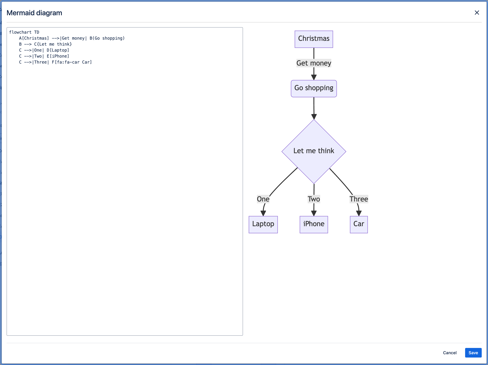

# ▮ ContentCraft: Mermaid diagrams for Confluence

## Overview

|  | "ContentCraft: Mermaid diagrams for Confluence" is an app, that  provides a powerful "Mermaid Diagram" macro that enables users to effortlessly create and render diagrams using Mermaid syntax directly on their Confluence pages. This tool is perfect for visually representing complex information such as flowcharts, sequence diagrams, Gantt charts, and more. By integrating Mermaid syntax, users can enhance their documentation with visually appealing and easy-to-understand diagrams, making their Confluence pages more dynamic and informative. The app is ideal for teams looking to improve their communication and documentation through clear and concise visual representations. |
|---|:---|

### Who is this app for?
This app is for teams and individuals who use Confluence and want to easily create and embed visually appealing diagrams using Mermaid syntax to enhance their documentation and communication.

## Installation and configuration

Install the app from Atlassian Marketplace.

## Features Overview

The "Mermaid Diagram" macro allows you to create and display various types of diagrams directly on Confluence pages using Mermaid syntax. With support for flowcharts, sequence diagrams, Gantt charts, and more, this macro makes it easy to visualize complex information. It integrates seamlessly into Confluence, enabling dynamic, interactive diagrams that enhance your team's documentation and collaboration.

Full list of supported diagram types:
- [Flowchart](./mermaid-syntax/flowcharts.md)
- [Sequence Diagram](./mermaid-syntax/sequence-diagrams.md)
- [Class Diagram](./mermaid-syntax/class-diagrams.md)
- [State Diagram](./mermaid-syntax/state-diagrams.md)
- [Entity Relationship Diagram](./mermaid-syntax/entity-relationship-diagrams.md)
- [User Journey](./mermaid-syntax/user-journey-diagram.md)
- [Gantt](./mermaid-syntax/gantt-diagrams.md)
- [Pie Chart](./mermaid-syntax/pie-chart-diagrams.md)
- [Quadrant Chart](./mermaid-syntax/quadrant-chart.md)
- [Requirement Diagram](./mermaid-syntax/requirement-diagram.md)
- [Gitgraph (Git) Diagram](./mermaid-syntax/)
- [Mindmaps](./mermaid-syntax/mindmap.md)
- [Timeline](./mermaid-syntax/timeline.md)
- [Sankey](./mermaid-syntax/sankey-diagram.md)
- [XYChart 🔥](./mermaid-syntax/xy-chart.md)
- [Block Diagram 🔥](./mermaid-syntax/block-diagrams-documentation.md)

