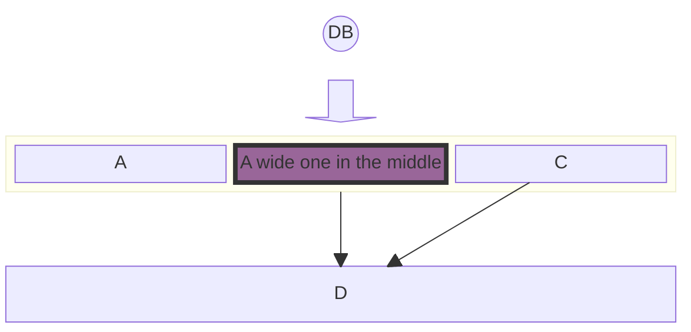

# Block Diagrams Documentation

## Overview

Block diagrams are a clear and efficient way to visually represent complex systems, processes, or architectures. They use blocks to represent key components or functions, and connectors to show how these components interact or flow together. This approach is useful in fields like engineering, software development, and process management.

Block diagrams offer a high-level view of a system, making it easier to understand and analyze without getting bogged down in details. They simplify complex systems and illustrate the overall structure and interactions between components.

In mermaid flowcharts, automatic layout can sometimes move shapes to undesired positions. Block diagrams offer a different approach by giving the author full control over the placement of shapes.


## Code

```
block-beta
columns 1
  db(("DB"))
  blockArrowId6<["&nbsp;&nbsp;&nbsp;"]>(down)
  block:ID
    A
    B["A wide one in the middle"]
    C
  end
  space
  D
  ID --> D
  C --> D
  style B fill:#969,stroke:#333,stroke-width:4px

```

## Example

