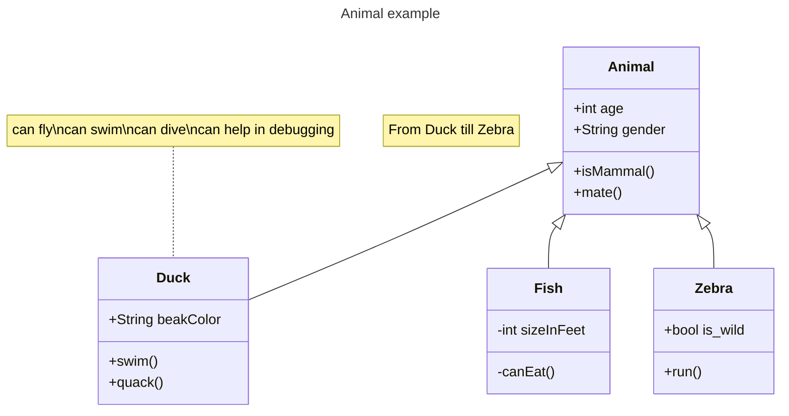

# Class diagrams

## Overview

The class diagram is a fundamental tool in object-oriented modeling. It's used for both high-level conceptual modeling of an application's structure and detailed modeling that translates into programming code. Class diagrams can also be applied to data modeling. In these diagrams, classes represent key elements, interactions within the application, and the classes to be programmed.


## Code

```
---
title: Animal example
---
classDiagram
    note "From Duck till Zebra"
    Animal <|-- Duck
    note for Duck "can fly\ncan swim\ncan dive\ncan help in debugging"
    Animal <|-- Fish
    Animal <|-- Zebra
    Animal : +int age
    Animal : +String gender
    Animal: +isMammal()
    Animal: +mate()
    class Duck{
        +String beakColor
        +swim()
        +quack()
    }
    class Fish{
        -int sizeInFeet
        -canEat()
    }
    class Zebra{
        +bool is_wild
        +run()
    }
```

## Example


