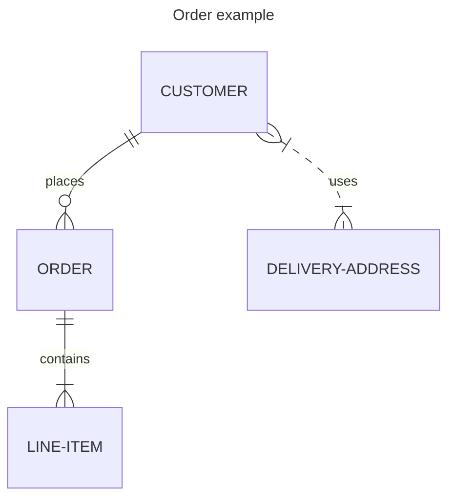

# Entity Relationship Diagram

## Overview

An entity–relationship model (ER model) describes the interrelated elements within a specific domain of knowledge. A basic ER model consists of entity types, which categorize the elements of interest, and defines the relationships between entities (instances of these entity types).

Practitioners of ER modeling typically refer to entity types simply as entities. For example, the "CUSTOMER" entity type is usually called the "CUSTOMER" entity. While technically an entity is an abstract instance of an entity type, ER diagrams depict these abstract instances and their relationships. This is why entities are always named using singular nouns.


## Code

```
---
title: Order example
---
erDiagram
    CUSTOMER ||--o{ ORDER : places
    ORDER ||--|{ LINE-ITEM : contains
    CUSTOMER }|..|{ DELIVERY-ADDRESS : uses
```

## Example


