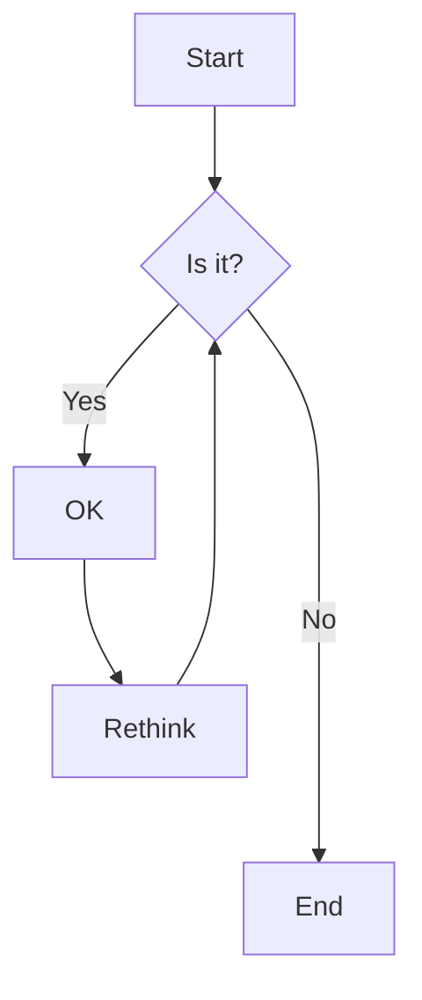

# Flowcharts

## Overview

Flowcharts consist of nodes (geometric shapes) and edges (arrows or lines). Mermaid code defines how these nodes and edges are created, allowing for various arrow types, multi-directional arrows, and links to and from subgraphs.


## Code

```
flowchart TD
    A[Start] --> B{Is it?}
    B -->|Yes| C[OK]
    C --> D[Rethink]
    D --> B
    B ---->|No| E[End]

```

## Example


