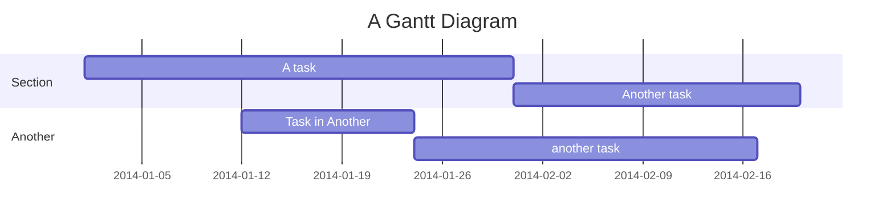

# Gantt diagrams

## Overview

A Gantt chart, first developed by Karol Adamiecki in 1896 and later by Henry Gantt in the 1910s, is a bar chart that shows a project schedule and the time required to complete it. It displays the number of days between the start and finish dates of the project's tasks and milestones.


## Code

```
gantt
    title A Gantt Diagram
    dateFormat YYYY-MM-DD
    section Section
        A task          :a1, 2014-01-01, 30d
        Another task    :after a1, 20d
    section Another
        Task in Another :2014-01-12, 12d
        another task    :24d
```

## Example


