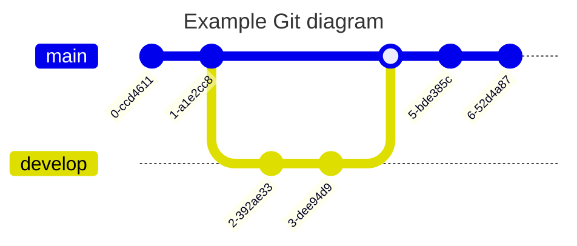

# Gitgraph Diagrams

## Overview

A Git Graph visually represents git commits and actions (commands) across different branches. This type of diagram helps developers and DevOps teams share and understand their Git branching strategies, making it easier to visualize workflows like git flow.


## Code

```
---
title: Example Git diagram
---
gitGraph
   commit
   commit
   branch develop
   checkout develop
   commit
   commit
   checkout main
   merge develop
   commit
   commit

```

## Example

