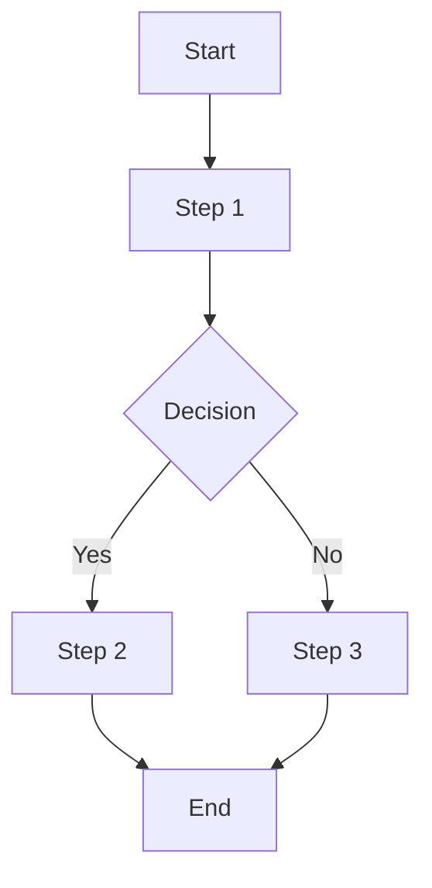

# Mermaid Diagram Syntax?

## Overview 

Mermaid diagram syntax is a lightweight, text-based language used to create various types of diagrams and charts. It allows users to define diagrams using simple, readable code that is then rendered into visual representations.


## Key Features of Mermaid Diagram Syntax

1. **Text-Based**: Diagrams are described using plain text, which makes it easy to create, edit, and version-control diagrams alongside code.

2. **Simple Syntax**: The syntax is designed to be intuitive, allowing users to quickly define elements such as nodes, links, and labels without needing complex graphic tools.

3. **Support for Multiple Diagram Types**: Mermaid supports various diagram types, including flowcharts, sequence diagrams, class diagrams, state diagrams, and Gantt charts.

4. **Integration**: Mermaid diagrams can be integrated into documentation, wikis, and other tools that support Markdown, providing a seamless way to include visualizations in text-based documents.

5. **Customization**: Users can customize the appearance and layout of diagrams using Mermaid’s syntax, which includes options for styling, alignment, and arrangement of elements.


## Example of Mermaid Syntax

For a simple flowchart, the Mermaid syntax might look like this:

```
graph TD
    A[Start] --> B[Step 1]
    B --> C{Decision}
    C -->|Yes| D[Step 2]
    C -->|No| E[Step 3]
    D --> F[End]
    E --> F
```



In this example:

- graph TD specifies the type of diagram (a top-down flowchart).
- A, B, C, D, E, and F are nodes.
- Arrows (-->) define the flow or connections between nodes.
- {} and |Yes|, |No| indicate decision points and options.


Mermaid syntax allows users to create and maintain diagrams in a text-based format, making it accessible and efficient for various documentation and visualization needs.


### More examples

Check out the various examples on the child pages of this section.