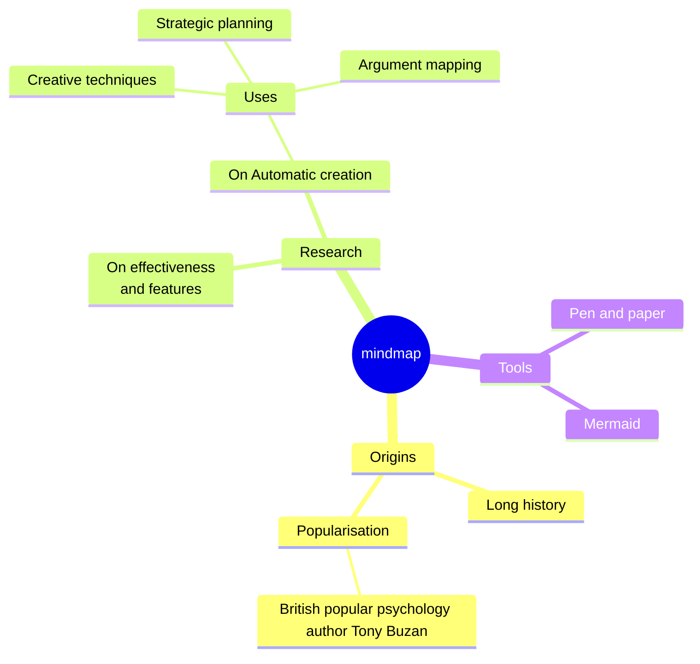

# Mindmap

## Overview

A mind map is a diagram that visually organizes information into a hierarchy, highlighting relationships among different parts. It usually starts with a central concept in the middle of a page, with related ideas, images, and words branching out from it. Major ideas connect directly to the central concept, and other ideas branch out from these main ideas.


## Code

```
mindmap
  root((mindmap))
    Origins
      Long history
      ::icon(fa fa-book)
      Popularisation
        British popular psychology author Tony Buzan
    Research
      On effectiveness<br/>and features
      On Automatic creation
        Uses
            Creative techniques
            Strategic planning
            Argument mapping
    Tools
      Pen and paper
      Mermaid
```

## Example

