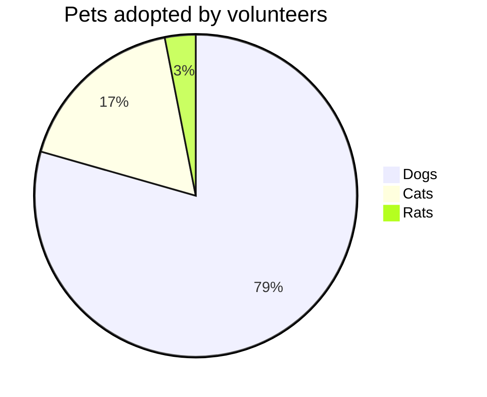

# Pie chart diagrams

## Overview

A pie chart (or circle chart) is a circular graphic divided into slices to show numerical proportions. Each slice's size is proportional to the quantity it represents. Though named for its pie-like appearance, there are various ways to present it.


## Code

```
pie title Pets adopted by volunteers
    "Dogs" : 386
    "Cats" : 85
    "Rats" : 15
```

## Example

