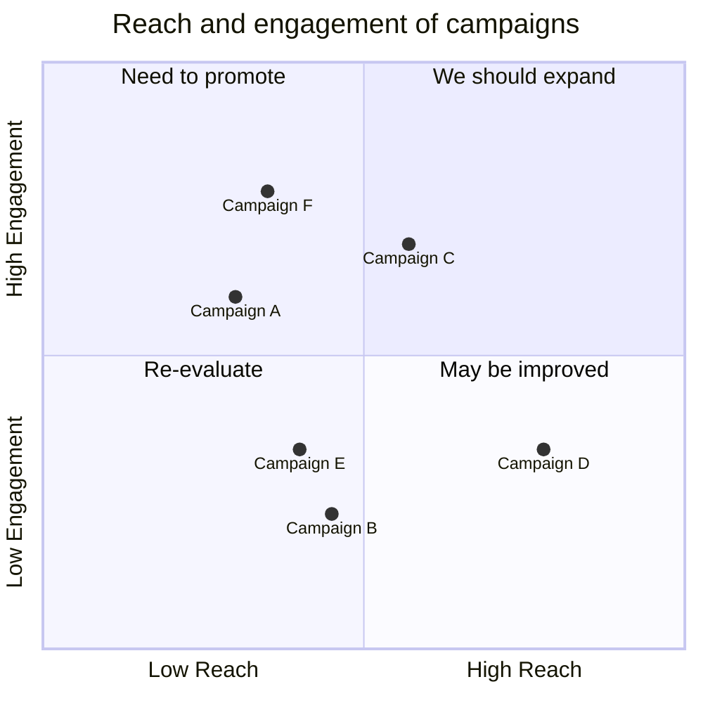

# Quadrant Chart

## Overview

A Quadrant chart visually divides data into four sections on a two-dimensional grid, with one variable on the x-axis and another on the y-axis. The chart is split into four equal parts based on specific criteria relevant to the data. Quadrant charts help identify patterns, trends, and prioritize actions by showing where data points fall within the chart. They're often used in business, marketing, and risk management.


## Code:

```
quadrantChart
    title Reach and engagement of campaigns
    x-axis Low Reach --> High Reach
    y-axis Low Engagement --> High Engagement
    quadrant-1 We should expand
    quadrant-2 Need to promote
    quadrant-3 Re-evaluate
    quadrant-4 May be improved
    Campaign A: [0.3, 0.6]
    Campaign B: [0.45, 0.23]
    Campaign C: [0.57, 0.69]
    Campaign D: [0.78, 0.34]
    Campaign E: [0.40, 0.34]
    Campaign F: [0.35, 0.78]
```

## Example


