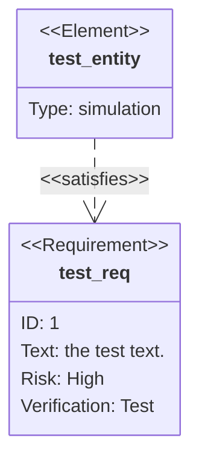

# Requirement diagram

## Overview

A Requirement diagram visualizes requirements and their connections to each other and other documented elements, following the SysML v1.6 standards.

## Code

```
    requirementDiagram

    requirement test_req {
    id: 1
    text: the test text.
    risk: high
    verifymethod: test
    }

    element test_entity {
    type: simulation
    }

    test_entity - satisfies -> test_req
```

## Example

