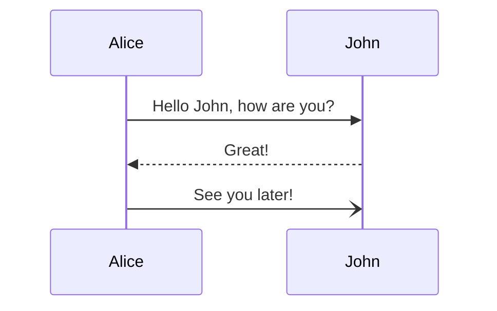

# Sequence diagram

## Overview

A Sequence diagram is an interaction diagram that illustrates how processes interact with each other and the order in which they occur.

## Code

```
sequenceDiagram
    Alice->>John: Hello John, how are you?
    John-->>Alice: Great!
    Alice-)John: See you later!
```

## Example

