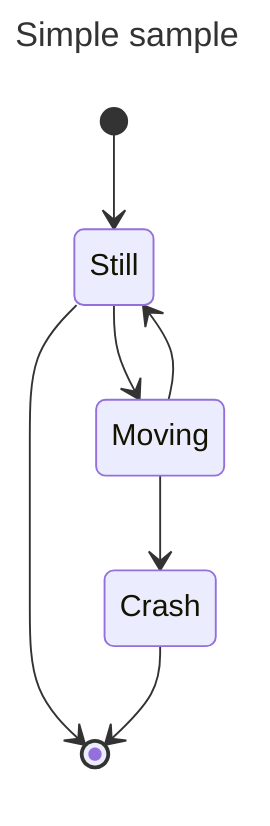

# State diagram

## Overview

A state diagram is used in computer science and related fields to describe system behavior. These diagrams assume the system has a finite number of states, which is sometimes true and other times a useful abstraction.


## Code

```
---
title: Simple sample
---
stateDiagram-v2
    [*] --> Still
    Still --> [*]

    Still --> Moving
    Moving --> Still
    Moving --> Crash
    Crash --> [*]
```

## Example


