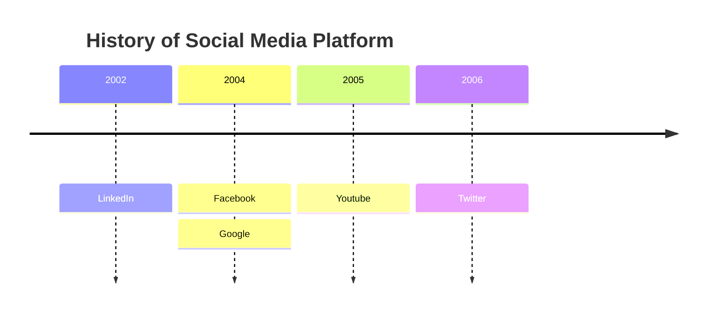

# Timeline diagram

## Overview

A Timeline is a diagram that visually represents a sequence of events, dates, or periods in chronological order. It typically uses dates as markers and shows the progression of time. Timelines can also highlight relationships between events, such as those in a person's life.


## Code

```
timeline
    title History of Social Media Platform
    2002 : LinkedIn
    2004 : Facebook
         : Google
    2005 : Youtube
    2006 : Twitter
```

## Example

