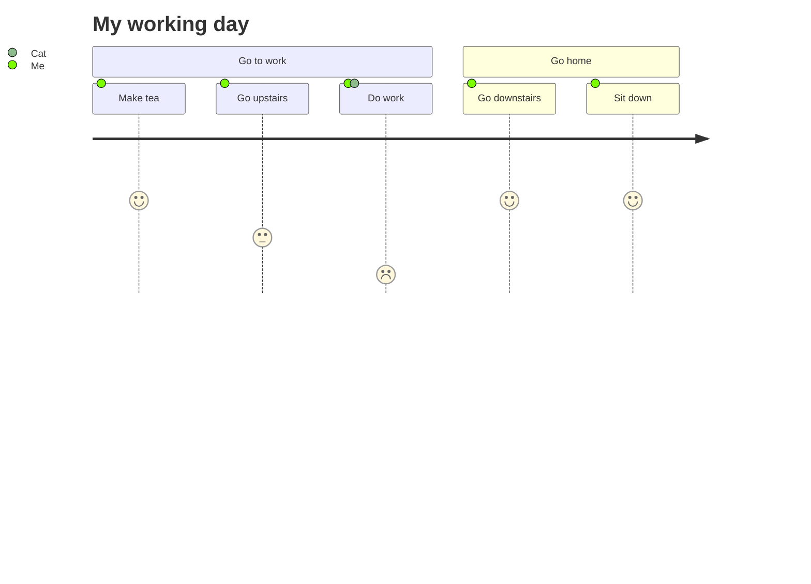

# User Journey Diagram

## Overview

User journeys outline the steps different users take to complete a specific task within a system, application, or website. This technique maps out the current (as-is) workflow and highlights areas for improvement in the future (to-be) workflow.


## Code

```
journey
    title My working day
    section Go to work
      Make tea: 5: Me
      Go upstairs: 3: Me
      Do work: 1: Me, Cat
    section Go home
      Go downstairs: 5: Me
      Sit down: 5: Me

```

## Example


