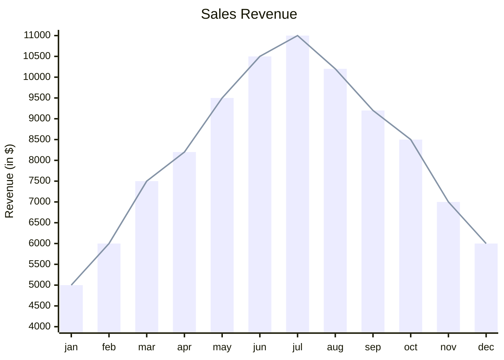

# XY Chart

## Overview

In mermaid, the XY chart module allows for creating charts that use both the x-axis and y-axis for data representation. Currently, it includes two main types: bar charts and line charts, which help visualize and analyze data with two numerical variables.
While these are the only chart types available now, mermaid is designed to be flexible and can expand to include more chart types in the future. This means users can expect new charting options to be added over time, meeting a variety of data visualization needs.


## Code

```
xychart-beta
    title "Sales Revenue"
    x-axis [jan, feb, mar, apr, may, jun, jul, aug, sep, oct, nov, dec]
    y-axis "Revenue (in $)" 4000 --> 11000
    bar [5000, 6000, 7500, 8200, 9500, 10500, 11000, 10200, 9200, 8500, 7000, 6000]
    line [5000, 6000, 7500, 8200, 9500, 10500, 11000, 10200, 9200, 8500, 7000, 6000]

```

## Example

