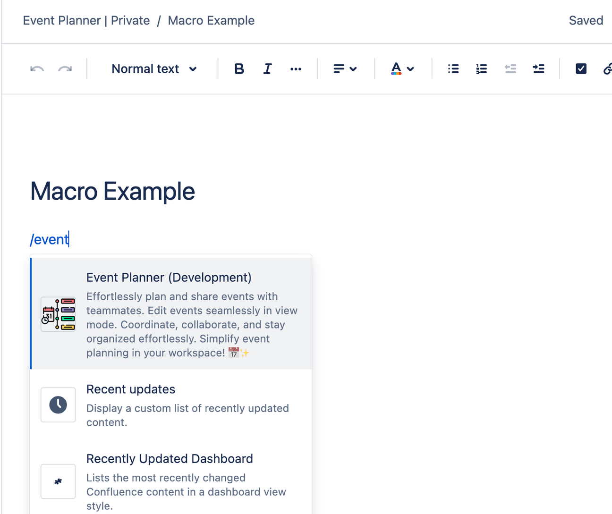
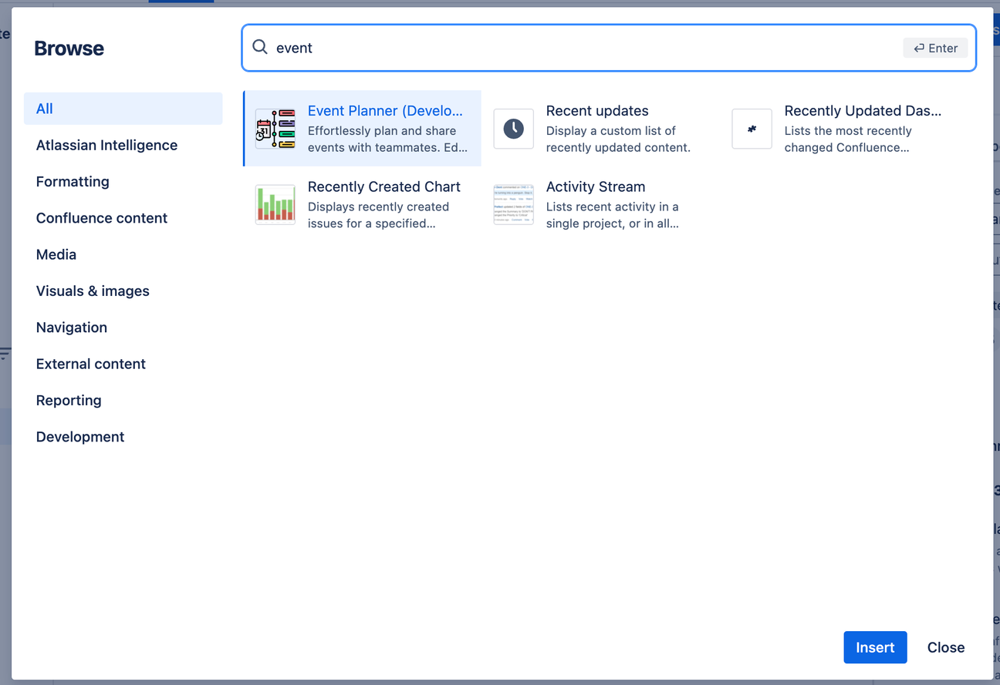
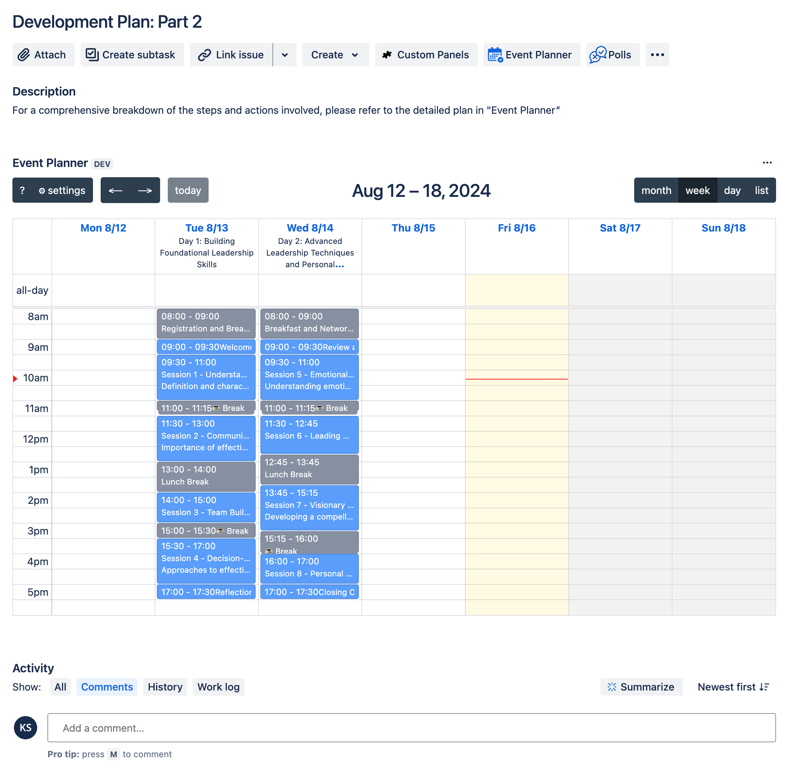
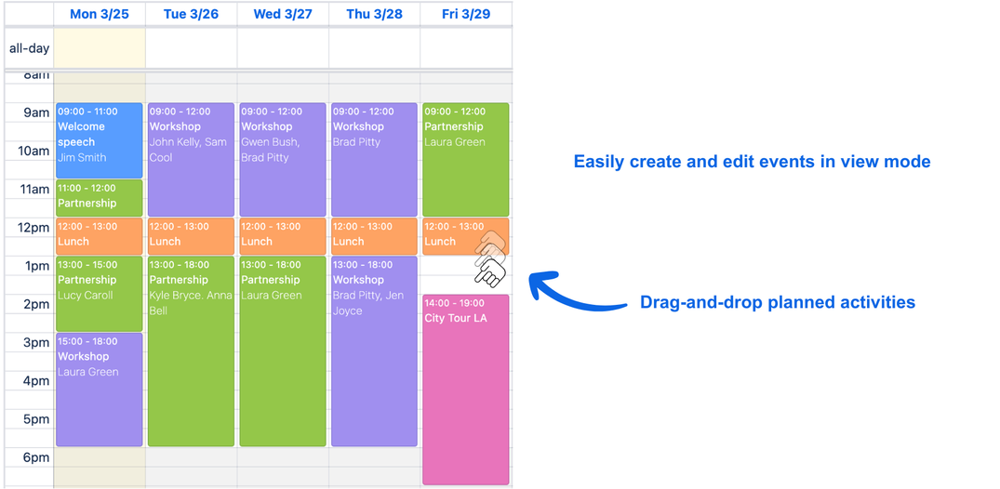
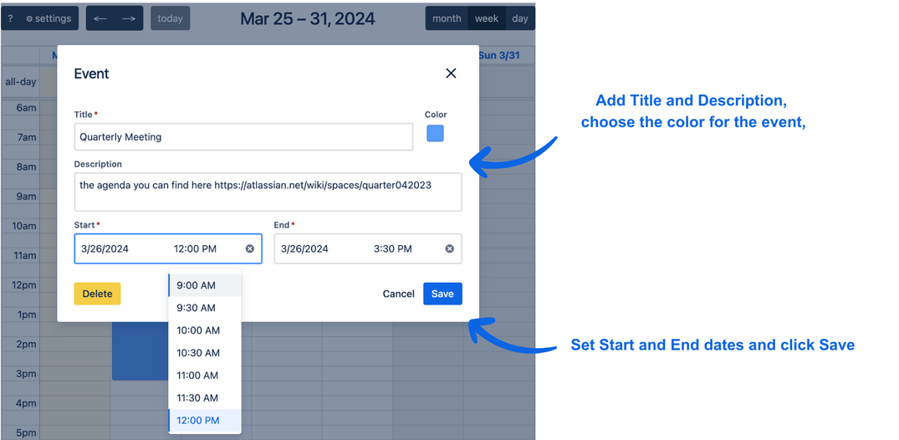
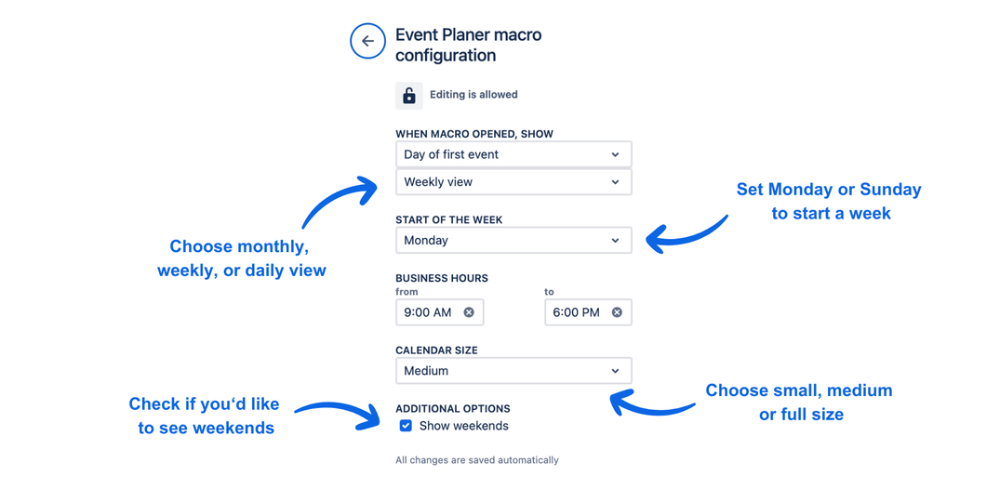
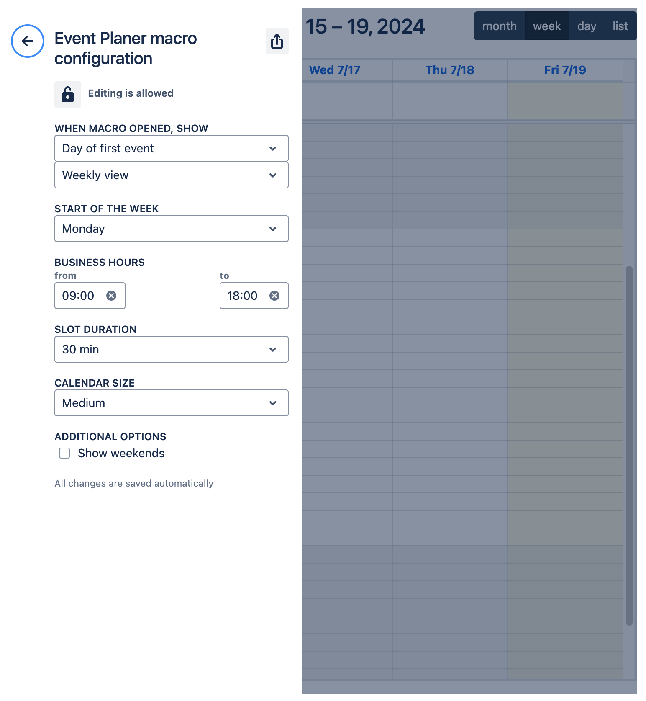
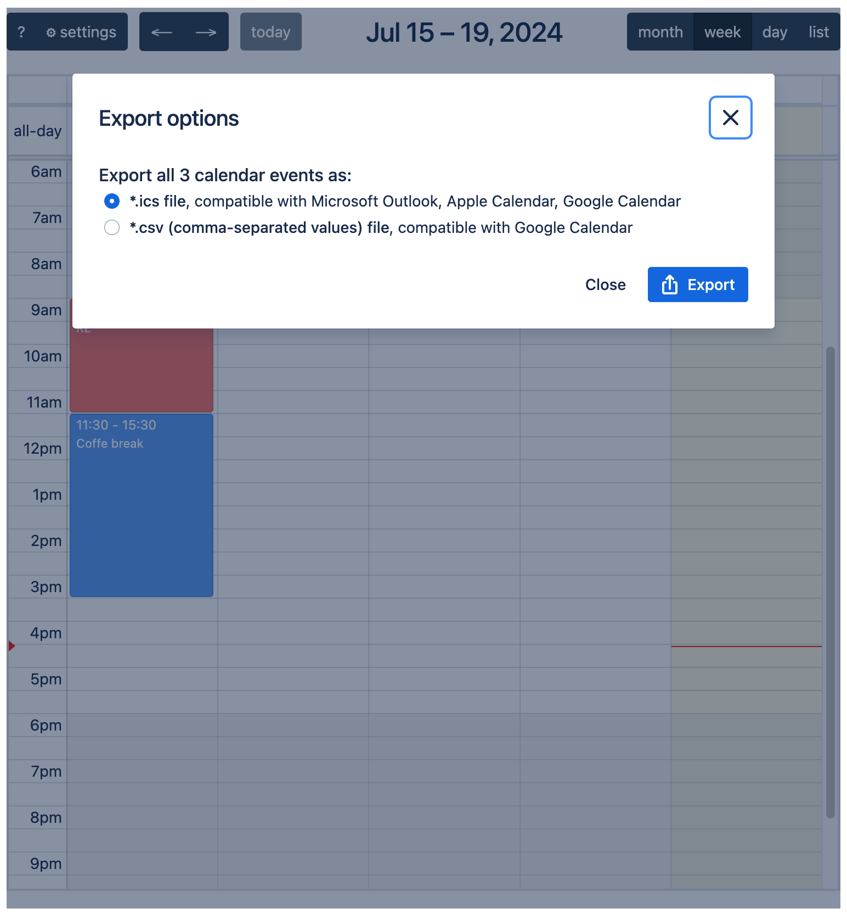

# ▮ Event Planner app

## Overview

|  | Effortlessly plan and manage events with [Free Event Planner for Confluence](https://marketplace.atlassian.com/apps/1233865) and [Free Event Planner for Jira](https://marketplace.atlassian.com/apps/1235075). |
| -------------------------------- | :---------------------------------------------------------------------------------------------------------------------------- |

 This intuitive [Confluence Macro](https://support.atlassian.com/confluence-cloud/docs/what-are-macros/) or Issue Panel lets you create and edit events directly in view mode, providing a clear overview of upcoming events. Ideal for collaborative planning, it securely stores all data on your instance, enhancing teamwork and productivity — all at no cost. Elevate your event planning experience today with this user-friendly and secure tool.

import ReactPlayer from 'react-player'

<ReactPlayer controls width='100%' url='https://www.youtube.com/watch?v=0uNdy_QY9sg' />

## Quick start

import Tabs from '@theme/Tabs';
import TabItem from '@theme/TabItem';

<Tabs>
  <TabItem value="conf" label="In Confluence version" default>
    There are two ways to start using the "Event Planner" macro:
    1. Type "/event" in the Editor to find the macro.
    

    2. Select a macro from the list of all macros in the Editor.
    
  </TabItem>
  <TabItem value="jira" label="In Jira version">
    Open "Event Planner" Issue Panel
    
  </TabItem>
</Tabs>

## Key Features

### Drag-and-Drop Events

- **Easy Drag-and-Drop:** Create events using various colors for better visualization and move them using drag-and-drop. Editing planned activities in view mode has never been so easy and convenient!

### Quick Event Creation

- **Add New Events in Just a Few Clicks:** Add new events in just a few clicks and use various fields while editing:
  - **Title**
  - **Description**
  - **Start and End Dates**
  
  For example, if you need to add a link, just insert it in the Description field!

### Customizable Macro

- **Configure the Macro to Best Suit You:** Customize your calendar's appearance by choosing the size, view, start of the week, and visibility of weekends to suit your preferences and needs.

### Export events

The macro provides beautiful export capabilities. You can export your event calendars to ICS or CSV formats. It gives you the compatibility with Microsoft Outlook, Apple Calendar and Google Calendar.

## Benefits

- **Intuitive Event Planning:** Simplify your event planning process with easy creation and editing of events in view mode.
- **Collaborative Planning:** Enhance teamwork and productivity with a tool designed for collaborative editing.
- **Data Security:** Keep all your data securely stored on your Cloud instance.
- **Free of Charge:** Enjoy all these features without any cost.

Elevate your event planning experience today with Free Event Planner!
