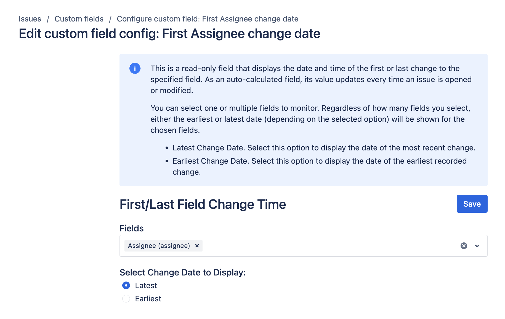

# First/Last Field Change Time

## Overview

The First/Last Field Change Time field is a read-only metric that shows the date and time of the first or last change to a specified field in Jira. This field automatically updates whenever an issue is opened or modified. To create and configure this field, refer to the [native Jira Custom Fields page](../getting-started.md).

You can monitor one or multiple fields with this feature. Depending on your selection, it will display either the earliest or latest change date for the chosen field(s).

- **Latest Change Date:** Displays the date of the most recent change to the selected field.
- **Earliest Change Date:** Displays the date of the first recorded change to the selected field.

## Use Cases

- **SLA Tracking:** Monitor and report on compliance with service-level agreements by tracking the latest update time of critical fields.
- **Auditing and Compliance:** Keep track of when important information fields were first or last updated to ensure regulatory compliance.
- **Performance Analysis:** Evaluate team efficiency by tracking how quickly certain fields are updated over time.
- **Issue Resolution Metrics:** Identify bottlenecks and improve processes by analyzing the time taken for the first or last change in specific fields related to issue resolution.
