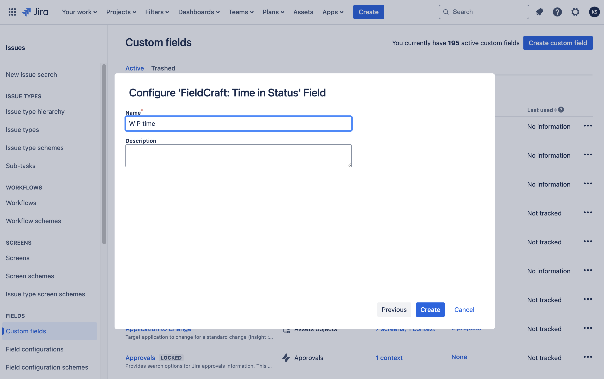

# Getting Started

## Add a Custom Field

You can create and configure **FieldCraft** custom fields using the native Jira Custom Fields page:

1. Log into your Jira instance as an Administrator.
2. Click **Settings** in the upper right corner.
3. Select **Issues**.
4. In the left-hand panel, click **Custom fields**.
5. Click **Create custom field** in the upper right corner.
  

  
Example

  

  
  

6. In the **Select a Field Type** window, click **Advanced**.
7. Choose the **FieldCraft** field type you want to add and click **Next**.
  

  
Example

  

  
  

8. Provide a name and optionally, a description for the custom field.
  

  
Example

  

  
  

9.  Click **Create**.
10. Follow the steps in the next section to configure your custom field.
  

  
Example

  

  
  
  
  
  

:::note

The new custom field will not calculate until its contexts have been updated. This applies even when the custom field is configured for the Default context.

:::

## Edit a Custom Field

To edit a **FieldCraft** custom field:

1. Go to the Jira **Custom fields** administration page.
2. Find your custom field and click **Actions**.
3. Choose an option:
   - **Edit details**: Update the Field Name, Description, and Search Template.
   - **Contexts and default value**: Add or remove contexts, configure Default Value, and access Custom field config.
   - **Translation and options**: Set language-specific Name and Description.
   - **Associate to Screens**: Add or remove screens where the field appears.
   - **Move to Trash**: Remove the field from all screens and move it to Trash.

:::note

- Custom fields can be recovered from the Trash within 60 days.
- After 60 days, the field will be permanently deleted and cannot be recovered.

:::

