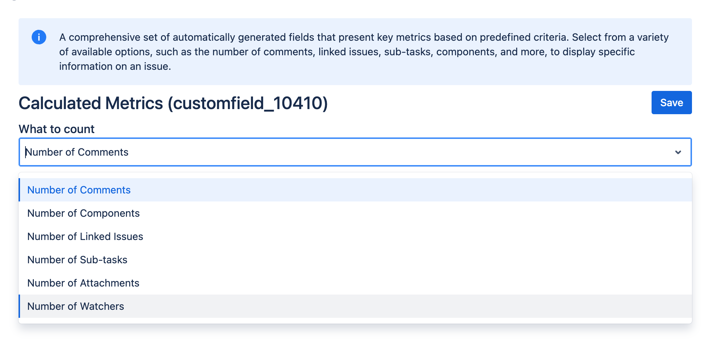

# Calculated Metrics

## Overview

|  | The Calculated Metrics field type provides a dynamic way to display key metrics on issues by automatically calculating and presenting data based on predefined parameters.  |
|---|:---|

This feature allows users to easily track and visualize important information, such as the number of comments, linked issues, sub-tasks, and other relevant attributes, directly within an issue.

## Use Cases

- Issue Tracking and Monitoring: Automatically display the number of linked issues or sub-tasks associated with a parent issue, making it easier to monitor dependencies and progress at a glance.
- Team Collaboration: Track the number of comments on an issue to gauge the level of team engagement and communication.
- Project Management: Display the number of components or custom attributes linked to an issue, providing project managers with quick insights into the complexity and scope of the task.

## Create and configure the custom field

Create and configure your custom field by following the instructions in our [Getting Started](../getting-started.md) guide on FieldCraft Custom Field Configuration.