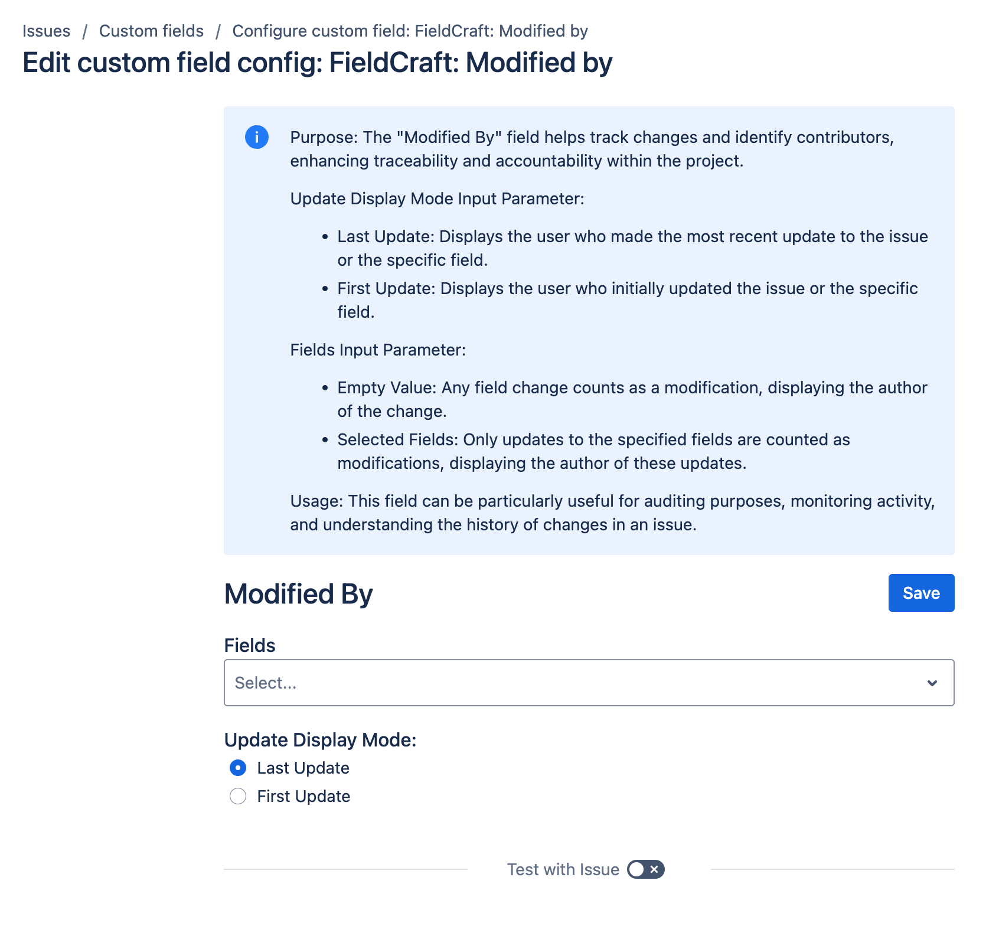

# Modified By

## Overview

|  | This read-only calculated custom field identifies the user who made the first or most recent update to the issue or a specific field within the issue. To create and configure this field, refer to the [native Jira Custom Fields page](../getting-started.md).  |
|---|:---|

The "Modified By" field helps track changes and identify contributors, enhancing traceability and accountability within the project.

## Update Display Mode Input Parameter
The "Update Display Mode" toggle button allows you to choose how the modifications are displayed:

- **First Update**: Displays the user who initially updated the issue or the specific field.
- **Last Update**: Displays the user who made the most recent update to the issue or the specific field.

## Fields Input Parameter
The "fields" input parameter determines which field changes count as modifications. 

- **Empty Value**: If this parameter is left empty, any field change will be counted as a modification, and the "Modified By" field will display the author of the change.
- **Selected Fields**: If specific fields are selected, only updates to these fields will be counted as modifications, and the "Modified By" field will display the author of these updates.

## Usage
This field can be particularly useful for:
- **Auditing Purposes**: Ensuring a clear record of who made changes and when.
- **Monitoring Activity**: Keeping track of active contributors and the frequency of changes.
- **Understanding Change History**: Gaining insights into the progression and updates made to an issue over time.

## Create and configure the custom field

Create and configure your custom field by following the instructions in our [Getting Started](../getting-started.md) guide on FieldCraft Custom Field Configuration.