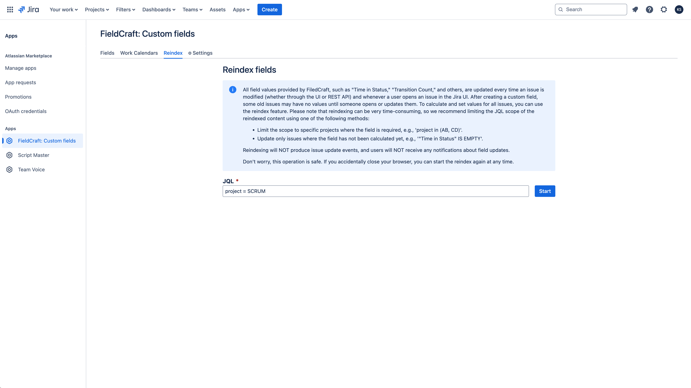

# Reindexing

## Overview

Reindexing is crucial in Jira to maintain **accurate search results**, **optimal performance**, and **data integrity**, especially after making changes to custom field configurations. For Jira administrators, reindexing ensures that any new configurations are consistently applied across all issues and projects.

If you're using the **FieldCraft app** with calculated fields, it's important for Jira administrators to reindex after updating field configurations. This not only applies the changes but also recalculates field values for older issues that haven't been accessed in a while. Reindexing ensures that calculated fields have up-to-date values, even for issues that haven’t been interacted with recently.

In Jira Cloud, there are **three events** that can trigger the calculation or recalculation of "[Time in Status](../time-in-status/)" and other calculated fields:
1. A user views the issue.
2. The issue is updated, triggering the Forge app to capture the "Issue Update" event (though this may occasionally be missed due to platform limitations).
3. A Jira administrator runs the reindex process, as described below.

---

## How to Perform a Reindex

To ensure your calculated fields are up to date, follow these steps to perform a reindex in Jira:

1. Open **Configuration** -> **Apps** -> **FieldCraft: Custom Fields** -> **Reindex**.
2. Enter the **JQL** to reindex only the affected issues. For example, `project = SCRUM` will target all issues within the SCRUM project.
3. Click **Start**, and make sure not to close the tab until the reindexing process completes.

