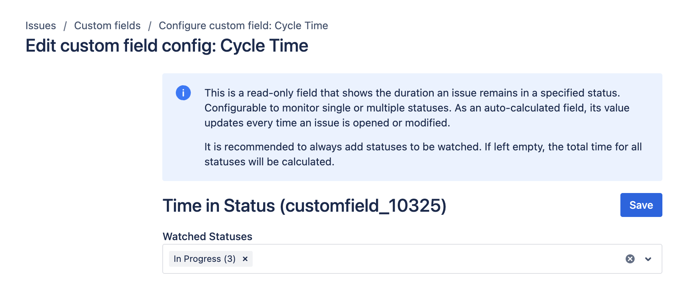
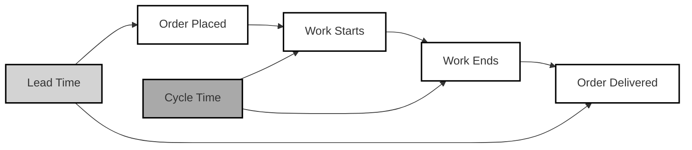

# Time in Status

## Overview

The Time in Status field is a read-only metric that displays how long an issue remains in a specified status in Jira. It can monitor single or multiple statuses and automatically updates whenever an issue is opened or modified. To create and configure this field, refer to the [native Jira Custom Fields page](../getting-started.md).

To use this field effectively, ensure you add statuses to monitor. If no statuses are specified, the field calculates the total time across all statuses.

## Use Cases

- **Cycle Time:** Measure the average time it takes for an issue to move through its workflow stages.
- **Lead Time:** Track the total time taken from the creation of an issue to its resolution.
- **WIP (Work in Progress) Time:** Monitor how long issues are actively being worked on in different statuses to identify bottlenecks or inefficiencies.

