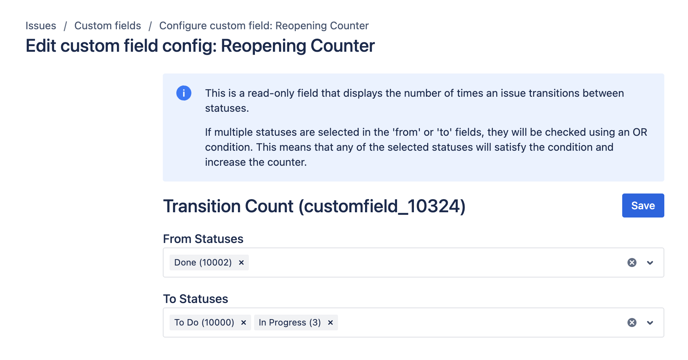

# Transitions Count

## Overview

The Transitions Count field is a read-only metric that tracks how many times an issue transitions between statuses in Jira. To create and configure this field, refer to the [native Jira Custom Fields page](../getting-started.md).

When configuring this field:
- If multiple statuses are selected in the 'from' or 'to' fields, they are evaluated using an OR condition. This means that any selected status will increase the counter.

## Use Cases

- **Issue Attention Highlighting:** Helps identify issues needing more attention, such as tracking the number of times an issue is reopened.
- **Quality Assurance Metrics:** Provides KPI/SLA metrics, like counting transitions to critical statuses such as 'Escalate', crucial for support teams.
