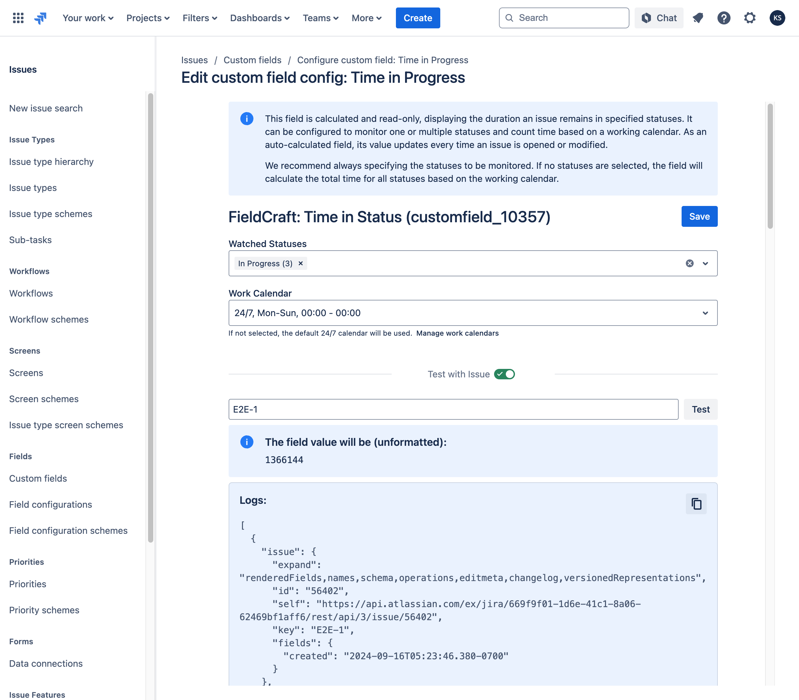

# Troubleshooting and Support

## Questions, bug reports, feature requests

If you have any questions or encounter issues while using our app, please don't hesitate to reach out to [our support team](https://kaisersoftapps.atlassian.net/servicedesk/customer/portal/1).

To help resolve your issue efficiently, our support team may request debugging information from the app. Please follow these steps to provide it:

1. Navigate to the **Jira Admin** menu and select **Apps**.
2. In the **Apps** section, choose **FieldCraft: Custom Fields** and click on the **Settings** tab.
3. Scroll down to the **Troubleshooting and Support** section and copy the details from the debugging panel.
4. Kindly share this debugging information with our team when requested.

## How to Verify the Calculation of an Auto-Calculated Custom Field in Jira

This guide will help you review the calculation details for custom fields like "Time in Status" and investigate any discrepancies between the calculated time and your expectations.

1. **Navigate to Custom Fields**:  
   Go to **Settings** → **Issues** → **Custom Fields**.
   
2. **Locate the Custom Field**:  
   Find the specific custom field you want to verify, then open its **context configuration** page.

3. **Review the Field Configuration**:  
   Scroll down to the **Check with issue** section on the configuration page.

4. **Test with an Issue**:  
   Enter the relevant issue key in the provided field and click **Test**.

5. **Review the Results**:  
   Check the expected result and the corresponding logs for any discrepancies.

6. **Submit Logs to Support**:  
   Copy the log details and send them to our support team for further investigation.

