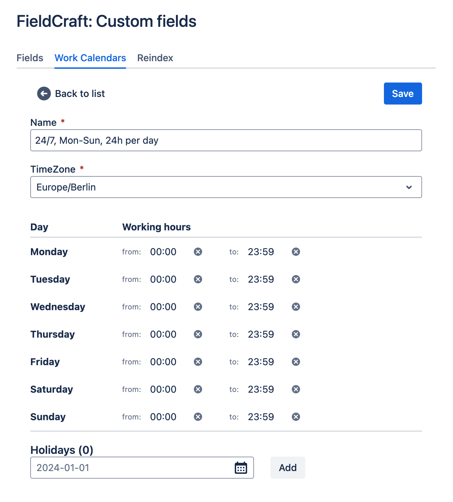
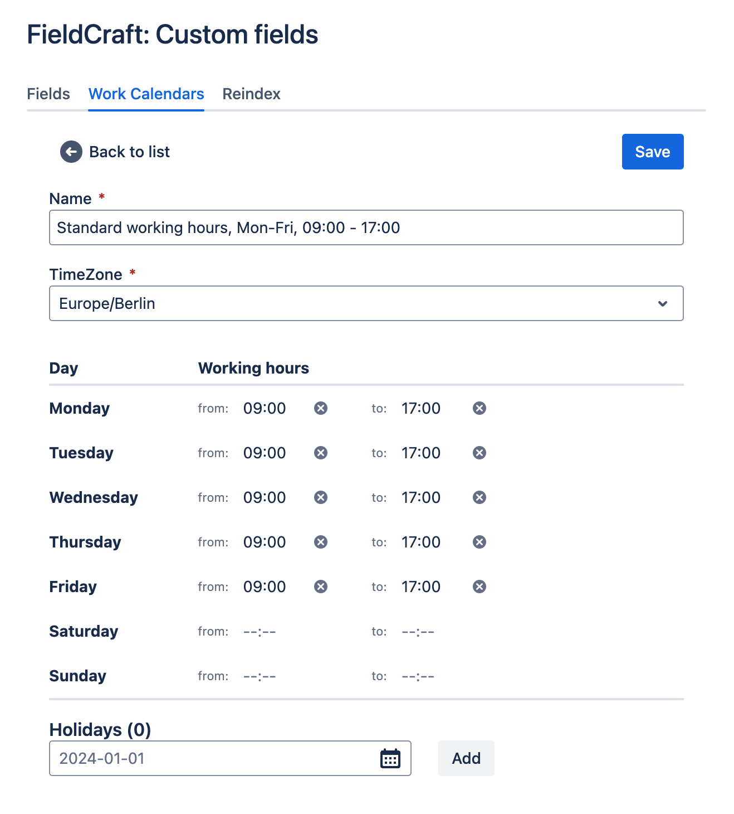

# Work Calendars

## Overview

Work Calendars let you control how time is tracked within fields like "[Time in Status](./time-in-status/index.md)". You can create and manage up to 10 distinct calendars, ideal for teams working in different time zones or with varying schedules. Only working hours within the calendar are counted for time-based fields, while time outside working hours or on holidays is excluded. This ensures accurate tracking based on real working periods.

## Example Calendar: 24/7

The 24/7 calendar is designed for teams that operate continuously, with no set working hours or holidays. It tracks time consistently across all days of the week, from Monday to Sunday, with 24 hours per day counted as working time. This setup ensures that any time-based tracking, such as "Time in Status," captures the full duration without any gaps or exclusions for non-working hours or holidays. It’s ideal for organizations requiring uninterrupted tracking.

## Example Calendar: Standard Working Hours

The Standard Working Hours calendar is tailored for teams following a typical workweek schedule, operating Monday through Friday from 09:00 to 17:00. Only the hours within this range are considered for tracking fields like "Time in Status." Time outside of these hours, including weekends and holidays, is excluded. This setup provides accurate tracking during regular business hours, ideal for teams with consistent work schedules.

