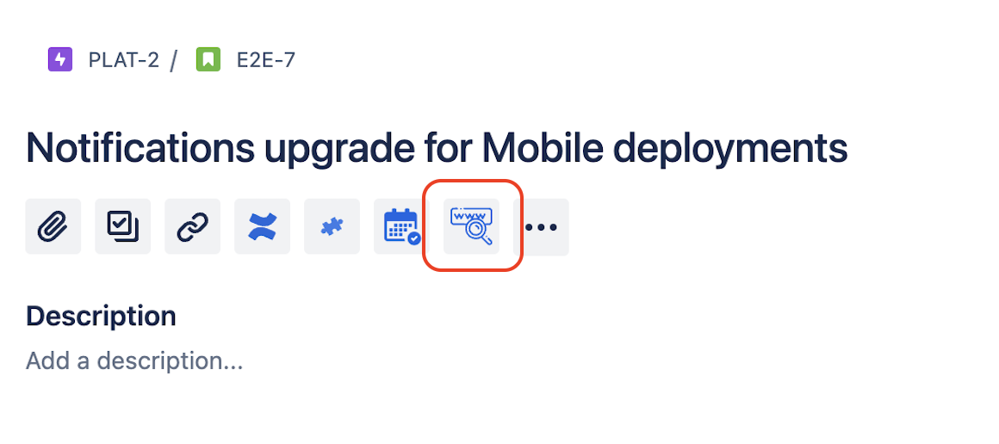
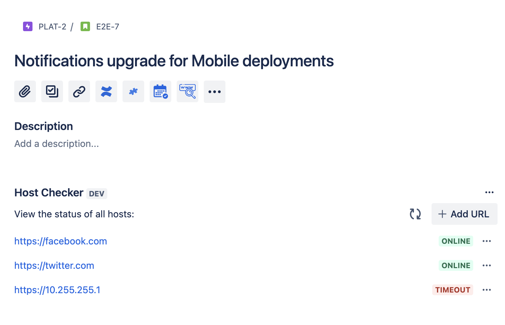
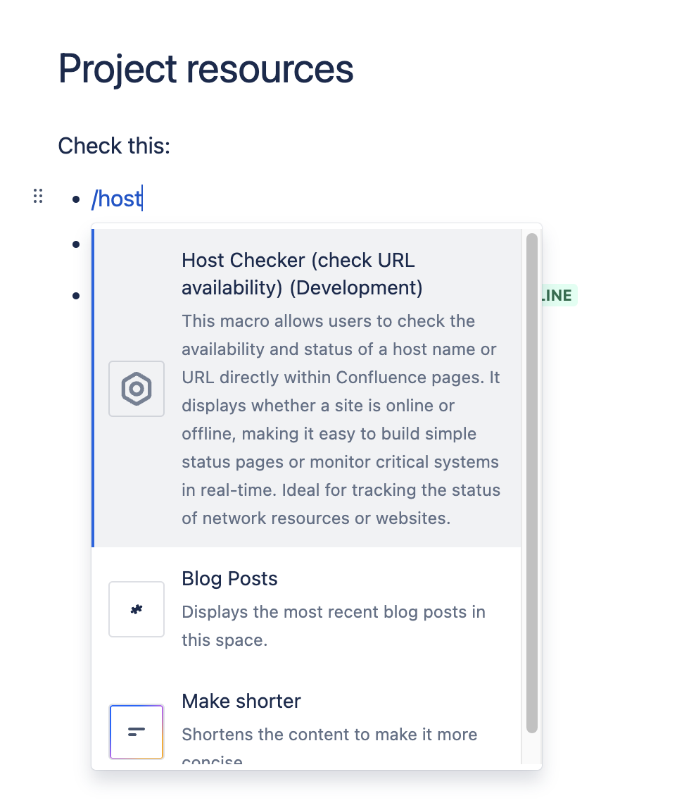
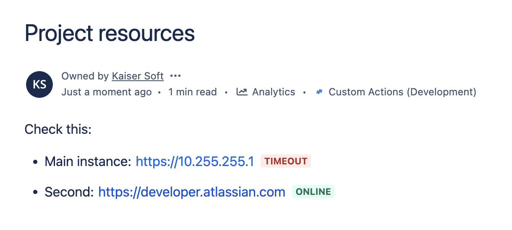

# ▮ Host Checker

## Overview

**Host Checker for Jira & Confluence** allows you to monitor the availability of URLs and host names within both Jira issues and Confluence pages. It provides real-time status updates, showing whether a site is online or offline, making it an essential tool for tracking key systems and services, performing inventory checks, and building simple status pages.

## Installation and Configuration

Install the app from the Atlassian Marketplace:

-  [Host Checker for Confluence](https://marketplace.atlassian.com/apps/1235400)
-  [Host Checker for Jira](https://marketplace.atlassian.com/apps/1235421)

To use the app:

import Tabs from '@theme/Tabs';
import TabItem from '@theme/TabItem';
import ReactPlayer from 'react-player'

<Tabs>
  <TabItem value="jira" label="In Jira version" default>
    - Open any Jira issue
    - Enable "Host Checker" panel
    
    
  </TabItem>
  <TabItem value="conf" label="In Confluence version">
    - Open any Confluence page
    - Insert "Host Checkerm" macro
    
    
  </TabItem>
</Tabs>

## Features  
- Check URL and host status directly in Jira issues and Confluence pages  
- Display real-time online/offline status  
- Ideal for inventory checks and network monitoring  
- Build status pages in Confluence for transparency and reporting  
- Easy setup and integration into existing workflows in both Jira and Confluence  
- Helps teams monitor uptime and prevent potential system issues

Perfect for IT admins, support teams, and developers who need to monitor systems and services efficiently across Jira and Confluence.

## Testimonials from our internal Atlassian consultants
- *"Host Checker has been indispensable for monitoring our systems. It works seamlessly in both Jira and Confluence, giving us real-time visibility."*
- *"We rely on Host Checker to track our network availability. Its ease of use and smooth integration into Jira and Confluence make it a must-have for our team."*