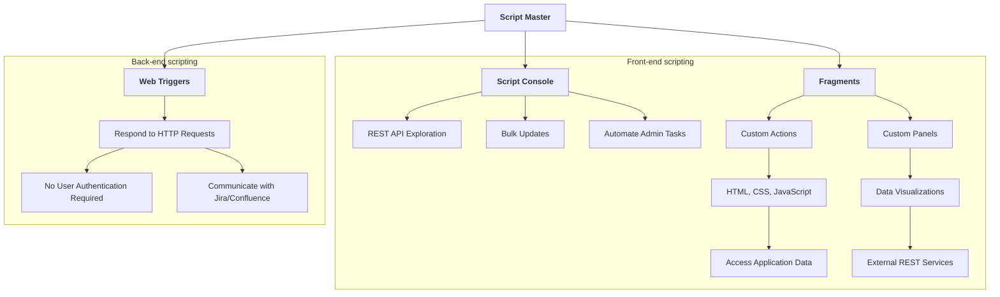

# Script Master for Confluence

[**Script Master for Confluence**](https://marketplace.atlassian.com/apps/1234082/script-master-for-confluence) is an app tailored for Confluence administrators, offering advanced tools for customization and automation within the Confluence application. It provides features such as the [Script Console](./script-console.md) for exploring REST APIs, executing bulk updates, and automating administrative tasks. Moreover, it facilitates the creation of Custom Page Actions and Content Byline Items using HTML, CSS, and JavaScript through [Fragments](./fragments.md), and offers [Web Triggers](./web-triggers.md) for handling HTTP requests seamlessly without user authentication.

## Features Overview

[**Script Master for Confluence**](https://marketplace.atlassian.com/apps/1234082/script-master-for-confluence) equips Confluence administrators with various capabilities to enhance and automate their Confluence instance. Below is a brief overview of the key features available:

## [Script Console](./script-console.md)

The [Script Console](./script-console.md) serves as the central hub for Confluence automations. It provides powerful tools such as:

- **REST API Exploration**: Experiment with the Confluence REST API seamlessly, enabling testing and debugging API calls directly within the console.
- **Bulk Updates**: Execute scripts to efficiently manage multiple pieces of content, facilitating large-scale changes across your Confluence instance.
- **Automate Admin Tasks**: Simplify and automate routine administrative duties, reducing manual effort and increasing efficiency.

## [Fragments](./fragments.md)

[Fragments](./fragments.md) are components that extend the Confluence UI to display Custom Page Actions or Content Byline Items. With fragments, you can:

- Extend the functionality of your Confluence application.
- Create data visualizations.
- Utilize HTML, CSS styles, and JavaScript.
- Access application data or external REST services.

## [Web Triggers](./web-triggers.md)

[Web Triggers](./web-triggers.md) are JavaScript functions running on the Forge back end that respond to HTTP requests. Notable features include:

- **No User Authentication Required**: Web Triggers can be executed without user authentication, enabling accessibility via their URL.
- **Communication with Confluence**: The URL can communicate with Confluence on behalf of the app using the `useApp()` method.

## Conclusion

With [**Script Master for Confluence**](https://marketplace.atlassian.com/apps/1234082/script-master-for-confluence), administrators gain a comprehensive toolset for customizing and automating their Confluence instance. Explore the Script Console, leverage Fragments for UI extensions, and set up Web Triggers for seamless integrations. Start transforming how you manage Confluence today!
