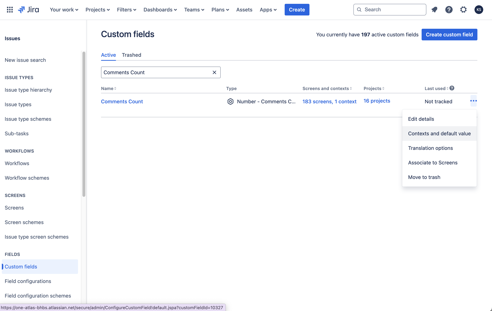

# Custom Fields

:::tip Compatibility

This module available in Script Master for **Jira** only.

:::

## Overview 

Scripted custom fields are Forge functions that execute on the Forge back-end and do not have access to the browser. You can make REST calls on behalf of the current user who opens an issue or on behalf of the app to ensure consistent calculation results when needed.

Scripted fields compute values each time users open the issue view with this field. The return value type must match the field type: a number for a "Number" field, a string for a "String" field, a string with a date in ISO format for a "Datetime" field, and an object with an accountId property for a "User" field type.

Scripted Custom Fields implements [Forge Jira custom field type](https://developer.atlassian.com/platform/forge/manifest-reference/modules/jira-custom-field-type/) module. 

## Context

Scripted Custom Fields implement Forge backend FaaS function, allowing you to utilize all [Bridge API for Forge backend FaaS function](../forge-bridge-back.md). Information about the current issue and field could be acccessed from `payload` object.

## Configuration

Scripted custom fields are native Jira Custom Fields. ScriptMaster enables you to create these fields using the native Jira Custom Fields page. To create a scripted custom field, search for "scripted" types in the "Advanced" section during the Custom Field creation process. 

### Add a Scripted Custom Field

You can create and configure scripted custom fields using the native Jira Custom Fields page:

1. Log into your Jira instance as an Administrator.
2. Click **Settings** in the upper right corner.
3. Select **Issues**.
4. In the left-hand panel, click **Custom fields**.
5. Click **Create custom field** in the upper right corner.
6. In the **Select a Field Type** window, click **Advanced**.
7. Choose the **Scripted** field type you want to add and click **Next**.
8. Provide a name and optionally, a description for the custom field.
9.  Click **Create**.

Screenshots:

:::note

The new scripted custom field computation function needs to be defined on the Context configuration page.

:::

### Edit a Scripted Custom Field

To edit a scripted custom field:

1. Go to the Jira **Custom fields** administration page.
2. Find your custom field and click **Actions**.
3. Choose an option:
   - **Edit details**: Update the Field Name, Description, and Search Template.
   - **Contexts and default value**: Add or remove contexts, configure Default Value, and access Custom field config.
   - **Translation and options**: Set language-specific Name and Description.
   - **Associate to Screens**: Add or remove screens where the field appears.
   - **Move to Trash**: Remove the field from all screens and move it to Trash.

:::note

- Custom fields can be recovered from the Trash within 60 days.
- After 60 days, the field will be permanently deleted and cannot be recovered.

:::

## Examples

- ### [Number field. Comments count](./example-comments-count.md)
  - This example of a Number scripted field returns the count of comments for the current issue. 
- ### [Number field. Attachments count](example-attachments-count.md)
  - This example of a Number scripted field returns the count of attachments for the current issue. 
- ### [Number field. Sub-tasks count](example-sub-tasks-count.md)
  - This example of a Number scripted field returns the count of sub-tasks for the current issue. 
- ### [String field. Parent Status](./example-parent-status.md)
  -  Displays the status of the parent issue.
- ### [User field. Parent Assignee](./example-parent-assignee.md)
  - Displays the Asssignee of the parent issue.
