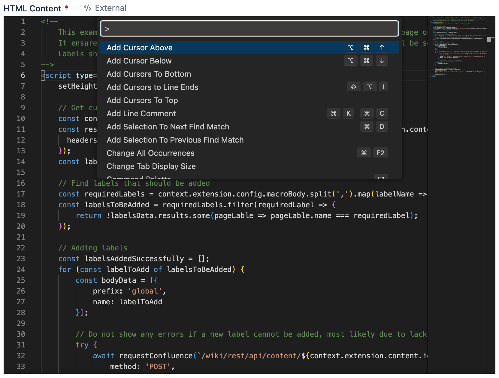

# Code Editor

## Overview

Script Master is now embedded with a more reliable and efficient editor - the Monaco editor. This editor has various useful features that give Atlassian administrators a better scripting experience.

This editor powers one of the most popular and effective editors — Visual Studio Code (VS Code), but it does not fully replace it, of course.

## Features

The features of the Monaco editor are as follows:

- **IntelliSense**. This term represents a variety of code features. These features include auto-completion of code, providing parameters and quick information, and displaying member lists.
- **Documentation and quick information**. You can view quick information for each method by either pressing the "autocomplete" shortcut or clicking the info icon. The accompanying explanation for the method or parameter expands to the side.
- **Parameter information and function signature**. After selecting a method or member function, the parameter information is displayed. You can also hover over a function to view its documentation or explanation.
- **Code linting**. The real-time code linting feature highlights syntactical and stylistic problems in the source code of JavaScript functions. ***Not available in JavaScript in HTML (like Fragments)***.

## Shortcuts

:::warning

We cannot guarantee that the all of the shortcuts are working properly since the operations may differ depending on the version of OS and browsers.

:::

Press `F1` to see Command Palette with all the available commenads and shortcuts.

Some of the most frequently used: 

|Action|Windows|Mac OS|
|---|---|---|
|Autocomplete|Ctrl+Space|Command+.|
|Undo|Ctrl+Z|Command+Z|
|Redo|Ctrl+Y|Command+Y|
|Toggle comment|Ctrl+/|Command+/|
|Add multi-cursor above|Ctrl+Alt+Up|Command+Option+Up|
|Add multi-cursor below|Ctrl+Alt+Down|Command+Option+Down|
|Select All|Ctrl+A|Command+A|
|Find|Ctrl+F|Command+F|
|Replace|Ctrl+H|Command+Option+F|

:::info

If the built-in editor does not fit your needs and you prefer to work in Visual Studio Code (VS Code) or a similar editor, [you can use any external editor to modify your code and update it automatically in Script Master](./external-editor.md). 

:::