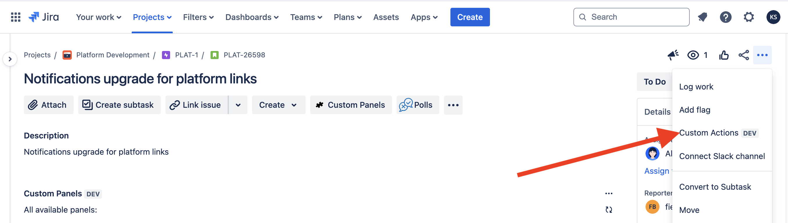
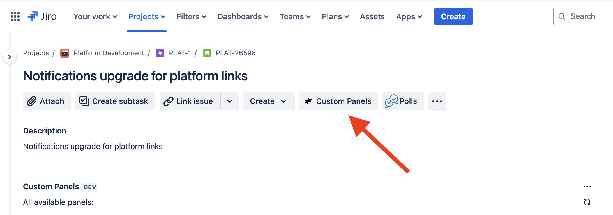
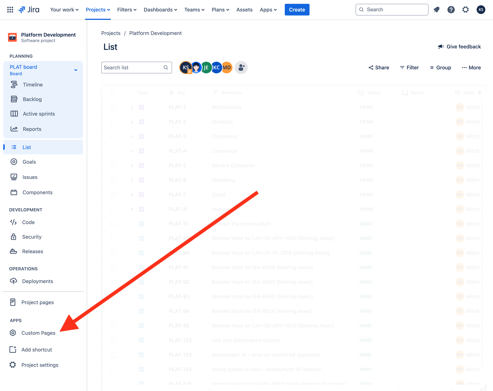
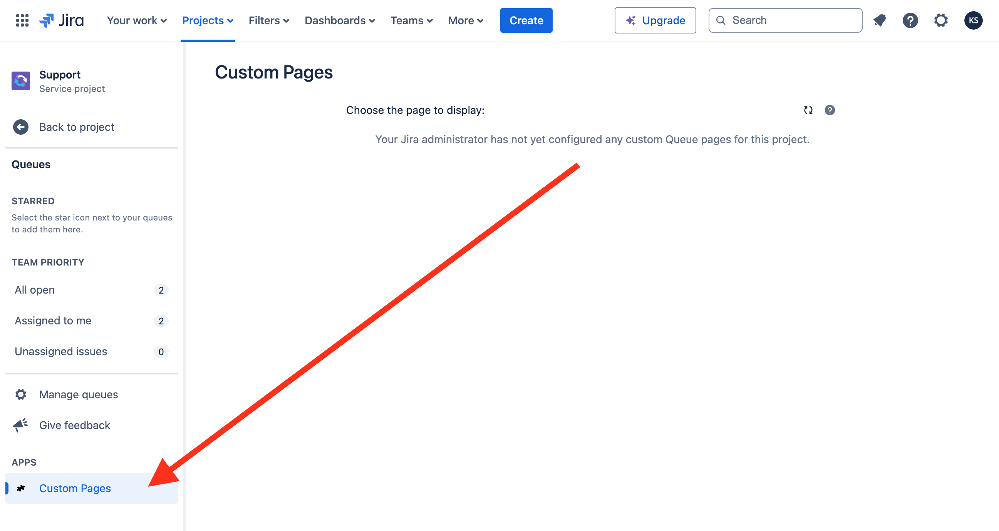
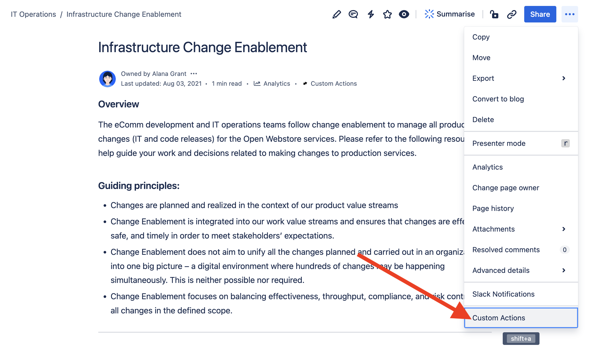
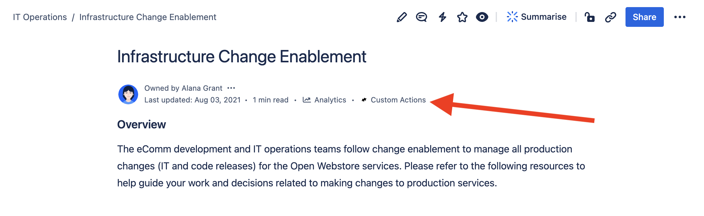
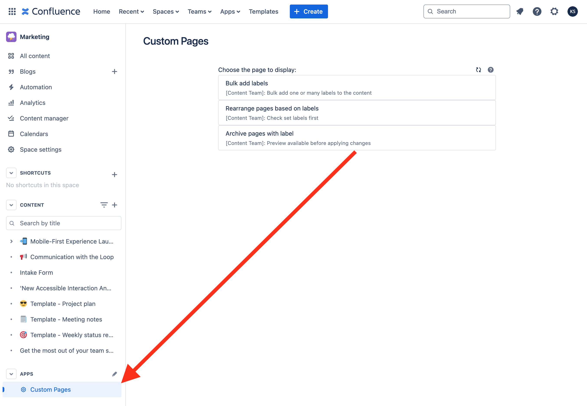

# Fragments

:::tip Compatibility

This module is available for both the **Jira** and **Confluence** versions of the app.

:::

Fragments are powerful blocks that extend the UI of Jira and Confluence, allowing you to display Custom Actions or Custom Elements in different places within the application. They provide flexibility to add new functionalities to your Jira and Confluence applications or enhance data visualizations. With Fragments, you can use HTML, CSS, and JavaScript, and access application data or external REST services.

## Creating and Managing Fragments

1. Navigate to the **Fragments** tab from the **Script Master** menu.
2. Click the "Create Fragment" button.
3. Fill in all the required fields for the new fragment.
4. Use HTML, CSS, and JavaScript inside the "Content" field to design your fragment.
5. Access necessary application data or external REST services to enhance functionality.

We are using a powerful code editor, which will assist you in writing code more efficiently. [Read more about Code Editor features, shortcuts, and more](../code-editor/index.md).

import Tabs from '@theme/Tabs';
import TabItem from '@theme/TabItem';

<Tabs>
  <TabItem value="jira" label="In Jira version" default>
    
  </TabItem>
</Tabs>

## Context

Fragments implement Forge Custom UI, allowing you to utilize all [Forge bridge APIs from Custom UI](../forge-bridge-front/index.md). Among the most useful are `view`, `requestConfluence`, `requestJira`.

## Available locations

### In Jira version

#### Jira Issue Action

Custom Jira Issue Actions are interactive elements that you can add to standart Issue Actions menu. They allow users to trigger specific actions or workflows with a simple click.

In Script Master, the Jira Issue Action implements forge [`jira:issueAction`](https://developer.atlassian.com/platform/forge/manifest-reference/modules/jira-issue-action/) module.

- **Use Cases**: 
  - Triggering scripts or automations
  - Initiating workflows
  - Providing quick access to frequently used functions

#### Jira Issue Panel

Custom Jira Issue Panels are UI components that can display detailed information, charts, or any custom content. This module can be used in Jira Work Management, Jira Software, and Jira Service Management. It works in the new issue view but is not compatible with the old issue view.

In Script Master, the Jira Issue Panel utilizes forge [`jira:issuePanel`](https://developer.atlassian.com/platform/forge/manifest-reference/modules/jira-issue-panel/) module.

- **Use Cases**: 
  - Displaying additional issue details
  - Visualizing data with charts or graphs
  - Integrating third-party service information

#### Jira Project Page

Custom Jira Project Page location adds an item to the Apps section in the left navigation of Jira company-managed project settings. Clicking this item opens a new Jira page with the rendered "Custom Pages".

In Script Master, the Jira Project Page utilizes forge [`jira:projectPage`](https://developer.atlassian.com/platform/forge/manifest-reference/modules/jira-project-page/) module.

- **Use Cases**: 
  - Displaying additional project details
  - Visualizing data with charts or graphs
  - Integrating third-party service information

#### Jira Service Management queue page

Custom Jira Service Management queue page location adds an item to the Apps section section in the left navigation of Queues in a service project. Clicking this item opens a new Jira page with the rendered "Custom Pages".

In Script Master, the Jira Service Management queue pagee utilizes forge [`jiraServiceManagement:queuePage`](https://developer.atlassian.com/platform/forge/manifest-reference/modules/jira-service-management-queue-page/) module.

- **Use Cases**: 
  - Displaying additional Service Management project details
  - Integrating third-party service information with JSM queue

### In Confluence version

#### Confluence Content Action

Custom Confluence Content Actions are interactive elements that you can add to standart "Page Actions" menu. They allow users to trigger specific actions or content workflows with a simple click.

In Script Master for Confluence, the Confluence Content Action implements forge [`confluence:contentAction`](https://developer.atlassian.com/platform/forge/manifest-reference/modules/confluence-content-action/) module.

- **Use Cases**: 
  - Triggering scripts or automations
  - Initiating page-related workflows
  - Providing quick access to frequently used functions

#### Confluence Content Byline Item

Custom Confluence content byline items are UI components that adds an entry to the content byline section, which is the part of the content under the title that includes metadata about contributors and more.

In Script Master for Confluence, the Confluence content byline represents forge [`confluence:contentBylineItem`](https://developer.atlassian.com/platform/forge/manifest-reference/modules/confluence-content-byline-item/) module.

- **Use Cases**: 
  - Displaying additional page details
  - Visualizing page data with charts or graphs
  - Integrating third-party service information

#### Confluence Space Page

Custom Confluence space pages are displays content in the left panel of a Confluence Space. It appears as a link titled "Custom Pages" in the space navigation menu. When a user clicks this link, a list of configured Custom Pages is rendered in the Confluence content area.

In Script Master for Confluence, the Confluence space pages utilizes forge [`confluence:spacePage`](https://developer.atlassian.com/platform/forge/manifest-reference/modules/confluence-space-page/) module.

- **Use Cases**: 
  - Displaying additional page details
  - Visualizing page data with charts or graphs
  - Integrating third-party service information

## Using Fragments

### HTML, CSS, and JavaScript

When creating Fragments, you can utilize standard web technologies to build and style your custom actions and panels.

- **HTML**: Define the structure and elements of your fragment.
- **CSS**: Style your fragment to ensure it integrates seamlessly with the Jira UI.
- **JavaScript**: Add interactivity, fetch data from Jira/Confluence or external APIs, and handle user events.

### Accessing Application Data

Fragments can interact with internal data of Jira and Confluence as well as external REST services. This allows you to create dynamic and context-aware UI components. To access your cloud application use [Forge Bridge API for Custom UI](../forge-bridge-front/index.md).

## Examples

- [Jira: Creating a Custom Action to show issue contributors](./example-issue-contributors.md). example to demonstrate how you can create a Custom Action that fetches and displays the list of all the user names who edited current issue.
- [Jira: Find unused project components](./example-find-unused-components.md). As a fragment for the "Project Page" location, you can find all the components without any issues and delete them in bulk.
- [Confluence: Get recent page contributors](./example-page-contributors.md). This script retrieves the list of recent contributors for the current page and prints them as a comma-separated string.

:::note More Examples

Find more fragment examples directly inside the app by using the "Snippets Library"

:::