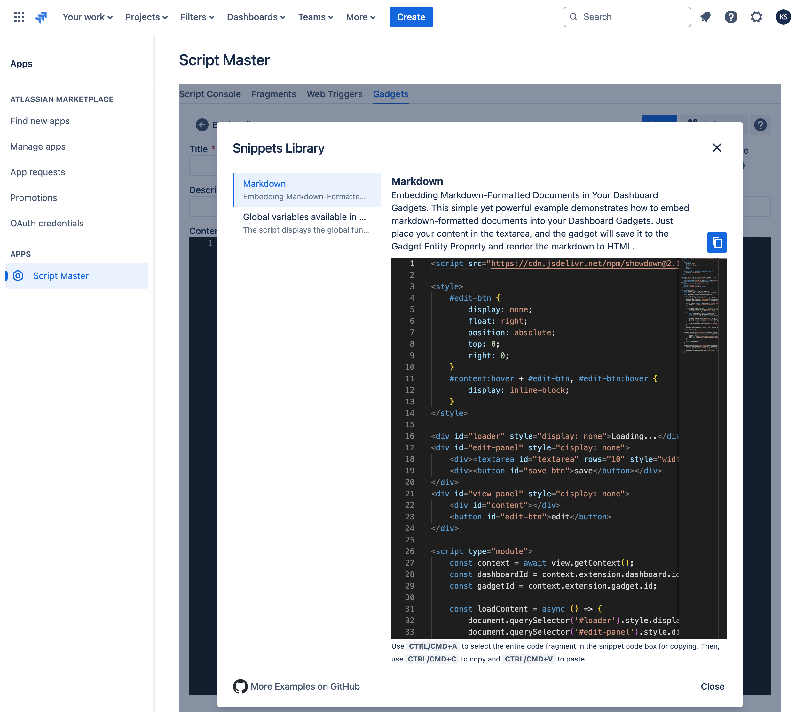

# Gadgets

:::tip Compatibility

This module available in Script Master for **Jira** only.

:::

## Overview 

Gadgets can be configured to enhance the functionality of your Jira dashboards. These gadgets make your dashboards more user-friendly for both administrators and team members by providing the information they need and smarter ways to interact with data. You can choose your custom gadget when editing a Jira dashboard, allowing you to tailor the experience to your specific requirements. 

This feature enables the creation of your own gadgets using HTML, CSS, and JavaScript, and accessing Jira application data or external REST services. Custom scripted Gadgets empower users to add dynamic and interactive visualizations, automate workflow processes, and create specialized interfaces, significantly improving the efficiency and effectiveness of your Jira dashboards.

Custom scripted Gadget implements [Forge Jira dashboard gadget](https://developer.atlassian.com/platform/forge/manifest-reference/modules/jira-dashboard-gadget/) module. 

## Context

Gadgets implement Forge Custom UI, allowing you to utilize all [Forge bridge APIs from Custom UI](../forge-bridge-front.md). Among the most useful are `view`, `requestJira`.

## Configuration

## Usage 

Add "Custom Gadgets" on the Dashboard:

Select your custom gadget:

See it in action:

## Examples

- [Embedding Markdown-Formatted Documents in Your Dashboard Gadgets](./example-markdown-editor.md). This simple yet powerful example demonstrates how to embed markdown-formatted documents into your Dashboard Gadgets. Just place your content in the textarea, and the gadget will save it to the Gadget Entity Property and render the markdown to HTML.

:::note

[More Examples on GitHub](https://github.com/kaisersoftapps/script-master)

:::