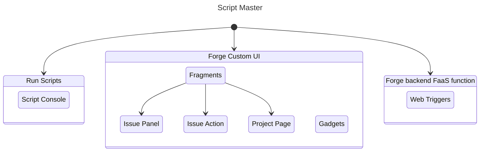

# Getting Started

## Quick Start

Welcome to **Script Master**! This quick start guide will help you get up and running with our powerful customization and automation tools for Jira and Confluence Cloud.

### Installation

After installing **Script Master**, the app will be available from the Administrator menu. Please note that only Application Administrators will have access to this menu and the app.

Marketplace:

- [**Script Master for Jira**](https://marketplace.atlassian.com/apps/1233958/script-master-for-jira)
- [**Script Master for Confluence**](https://marketplace.atlassian.com/apps/1234082/script-master-for-confluence)

### Accessing Script Master

To access **Script Master for Jira**:

1. Log in to your Jira instance as an administrator.
2. Navigate to the Jira administrator menu.
3. Select **Script Master** in the Apps section.

To access **Script Master for Confluence**:

1. Log in to your Confluence instance as an administrator.
2. Navigate to the Confluence administrator menu.
3. Select **Script Master** in the Apps section.

<!--  -->

### Start your customization journey with one of the modules

- [Script Console](./script-console/index.md)
- [Fragments](./fragments/index.md)
- [Gadgets](./gadgets/index.md)
- [Macros](./macros/index.md)
- [Wen Triggers](./web-triggers/index.md)