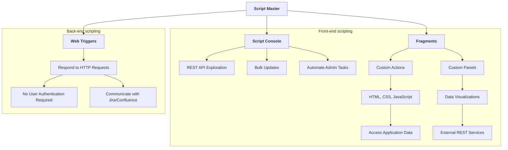

# ▮ Script Master app

## Overview

|  | Script Master is a revolutionary app built on top of the [Forge framework](https://developer.atlassian.com/platform/forge/). It allows Atlassian administrators to build Forge-compatible scripts and apps directly within Jira and Confluence, without the need for an IDE, complex build processes, or additional infrastructure. Atlassian administrators can automate tasks, extend the UI of Jira Cloud and Confluence Cloud, and create flexible integrations. |
|---|:---|

One of the main features is the [Script Console](./script-console/index.md), which is used for exploring REST APIs, executing bulk updates, and automating administrative tasks. Additionally, the app enables the creation of Custom UI elements using HTML, CSS, and JavaScript through [Fragments](./fragments/index.md), and offers [Web Triggers](./web-triggers/index.md) for handling HTTP requests without user authentication.

For Jira, there is the ability to build custom, scripted Gadgets, enhancing the functionality and user experience on your Jira Dashboards. Similarly, for Confluence, you can build custom, scripted Macros, allowing you to enhance and personalize the content on your Confluence pages. Both of these features utilize HTML, CSS, JavaScript, and can access application data or external REST services.

Script Master has two versions: one for Jira Cloud and one for Confluence Cloud. Both versions include the same modules, with only slight differences in the provided context. Read more about the [differences between the Jira and Confluence versions](./diff-between-jira-and-conf.md).

## Installation and configuration

Install the app from Atlassian Marketplace:

- [**Script Master for Jira**](https://marketplace.atlassian.com/apps/1233958/script-master-for-jira)
- [**Script Master for Confluence**](https://marketplace.atlassian.com/apps/1234082/script-master-for-confluence)

Follow the [Getting Started guide](./getting-started.md).

## Features Overview

[**Script Master**](https://marketplace.atlassian.com/apps/1233958/script-master-for-jira) provides multiple ways to customize and automate your Jira or Confluence instance. Below is a brief overview of the key features available:

## [Script Console](./script-console/index.md)

The [Script Console](./script-console/index.md) is your hub for automations. It offers several powerful tools:

- **REST API Exploration**: Experiment with the [Jira REST API](https://developer.atlassian.com/cloud/jira/platform/rest/v3) or [Confluence REST API](https://developer.atlassian.com/cloud/confluence/rest/v2) seamlessly, allowing you to test and debug API calls directly within the console.
- **Bulk Updates**: Execute scripts to manage multiple pieces of content efficiently. This is ideal for making large-scale changes across your instances.
- **Automate Admin Tasks**: Simplify and automate routine administrative duties, reducing manual effort and increasing efficiency.

## [Fragments](./fragments/index.md)

[Fragments](./fragments/index.md) are blocks that extend the UI to display Custom UI elements in various locations. With fragments, you can:

- Add new functionalities to your Jira or Confluence application.
- Create data visualizations.
- Utilize HTML, CSS styles, and JavaScript.
- Access application data or external REST services.

## [Gadgets (in Jira version only)](./gadgets/index.md)

[Custom Scripted Gadgets](./gadgets/index.md) are important because they provide Jira users with the flexibility to tailor their dashboards to specific needs. These gadgets can display dynamic data, automate complex workflows, and integrate seamlessly with other tools and services, enhancing productivity. By allowing users to create custom visualizations and interfaces, scripted gadgets help in making informed decisions faster and streamline project management processes. This level of customization ensures that each team can have a dashboard that perfectly fits their unique requirements and operational goals.

## [Macros (in Confluence version only)](./macros/index.md)

[Custom Scripted Macros](./macros/index.md) for Confluence empower users to enhance and personalize their Confluence pages. With these macros, users can create dynamic and interactive content, automate data integration, and streamline information presentation. This capability allows teams to build tailored solutions that meet specific collaboration needs, improving efficiency and user engagement. Custom Scripted Macros enable the embedding of real-time data, custom forms, and specialized content layouts, making Confluence a more powerful tool for knowledge sharing and project management.

## [Web Triggers](./web-triggers/index.md)

[Web Triggers](./web-triggers/index.md) are JavaScript functions running on the Forge back end that respond to HTTP requests. Key features include:

- **No User Authentication Required**: Web Triggers can be run without user authentication, making them accessible via their URL.
- **Communication with Jira**: The URL can communicate with Jira or Confluence on behalf of the app using the `useApp()` method.
