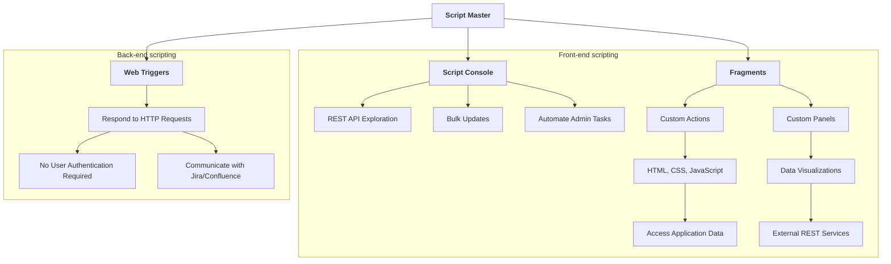

# Script Master for Jira 

[**Script Master for Jira**](https://marketplace.atlassian.com/apps/1233958/script-master-for-jira) is an app designed for Jira administrators, providing advanced tools for customization and automation. It features a [Script Console](./script-console.md) for exploring REST APIs, executing bulk updates, and automating administrative tasks. Additionally, it allows the creation of Custom Actions and Panels using HTML, CSS, and JavaScript through [Fragments](./fragments.md), and offers [Web Triggers](./web-triggers.md) for handling HTTP requests without user authentication.

## Features Overview

[**Script Master for Jira**](https://marketplace.atlassian.com/apps/1233958/script-master-for-jira) provides multiple ways to customize and automate your Jira instance. Below is a brief overview of the key features available:

## [Script Console](./script-console.md)

The [Script Console](./script-console.md) is your hub for Jira automations. It offers several powerful tools:

- **REST API Exploration**: Experiment with the Jira REST API seamlessly, allowing you to test and debug API calls directly within the console.
- **Bulk Updates**: Execute scripts to manage multiple pieces of content efficiently. This is ideal for making large-scale changes across your Jira instance.
- **Automate Admin Tasks**: Simplify and automate routine administrative duties, reducing manual effort and increasing efficiency.

## [Fragments](./fragments.md)

[Fragments](./fragments.md) are blocks that extend the UI to display Custom Actions or Custom Panels. With fragments, you can:

- Add new functionalities to your Jira application.
- Create data visualizations.
- Utilize HTML, CSS styles, and JavaScript.
- Access application data or external REST services.

## [Web Triggers](./web-triggers.md)

[Web Triggers](./web-triggers.md) are JavaScript functions running on the Forge back end that respond to HTTP requests. Key features include:

- **No User Authentication Required**: Web Triggers can be run without user authentication, making them accessible via their URL.
- **Communication with Jira**: The URL can communicate with Jira on behalf of the app using the `useApp()` method.

## Conclusion

With [**Script Master for Jira**](https://marketplace.atlassian.com/apps/1233958/script-master-for-jira), you have a comprehensive toolset for customizing and automating your Jira instance. Explore the Script Console, leverage Fragments for UI extensions, and set up Web Triggers for seamless integrations. Get started today and transform how you manage Jira!

For detailed documentation on each feature, refer to the full user manual available within the app.
