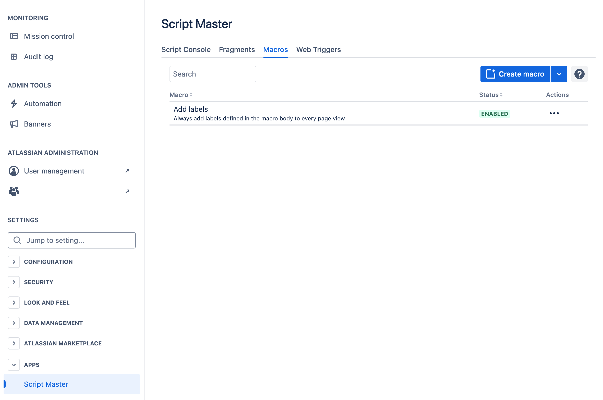
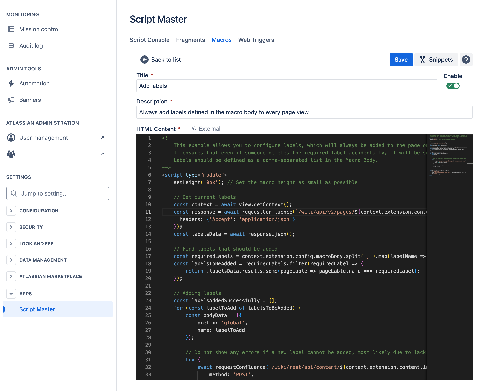

# Macros

:::tip Compatibility

This module available in Script Master for **Confluence** only.

:::

## Overview 

Custom Scripted Macros can be configured to enhance the content on your Confluence pages, making your organization’s pages easier to use for both editors and viewers by providing the information they need and smarter ways to build content. You can choose your custom macro when editing a Confluence Cloud page, allowing you to tailor the experience to your specific needs. This feature enables the creation of your own macros, utilizing HTML, CSS, and JavaScript, and accessing Confluence application data or external REST services. Custom Scripted Macros empower users to add dynamic and interactive content, automate data integration, and create specialized layouts, greatly improving the functionality and usability of your Confluence pages.

In Script Master, Macros serve as an extension of [Forge Macro module](https://developer.atlassian.com/platform/forge/manifest-reference/modules/macro/).

## Context

Macros implement Forge Custom UI, allowing you to utilize all [Forge bridge APIs from Custom UI](../forge-bridge-front.md). Among the most useful are `view`, `requestConfluence`.

:::note

[More Examples on GitHub](https://github.com/kaisersoftapps/script-master)

:::
