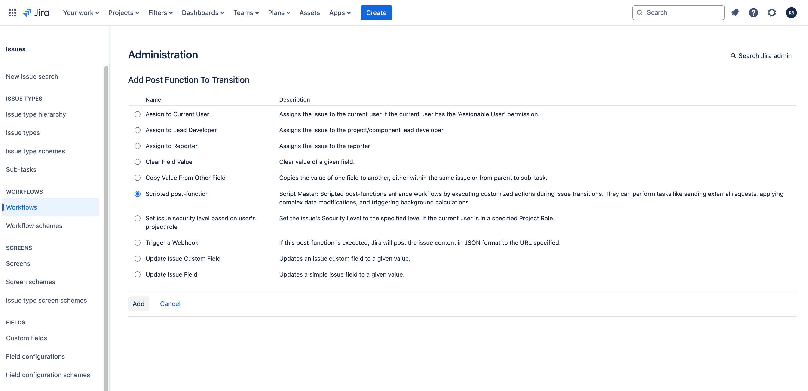
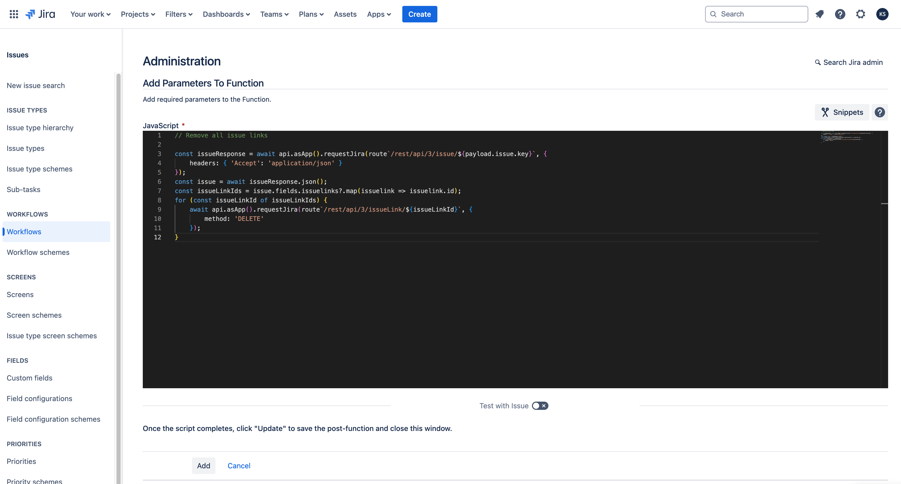
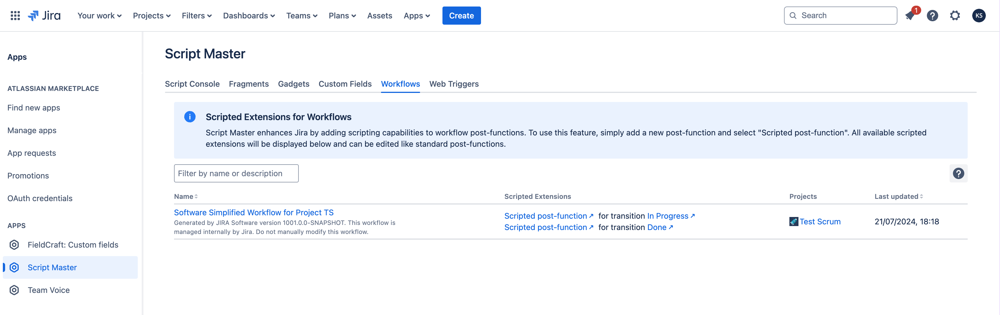

# Workflow post-functions

:::tip Compatibility

This module available in Script Master for **Jira** only.

:::


## Overview 

Scripted post-functions allow you to enhance your workflows by enabling the execution of highly customized and unique actions during issue transitions.
These post-functions can be configured to perform a variety of tasks, such as sending external requests, applying complex data modifications, triggering background calculations, and more.
  
Please note that the script size for a workflow post-function must not exceed 100 kB; otherwise, it will not be saved.

Scripted post-functions implements [Forge Jira workflow post function](https://developer.atlassian.com/platform/forge/manifest-reference/modules/jira-workflow-post-function/) module. 


## Context

As a Forge back-end SaaS function, scripted post-functions are executed on the Forge back-end, sometimes without a user context.

To make requests to Jira, use the `api.asApp().requestJira()` bridge method.

[Bridge API for Forge backend FaaS function](../forge-bridge-back.md). 

Information about the current issue and transitions could be acccessed from `payload` object.

<details>
<summary>payload type</summary>
<p>
```
interface Payload {
  extensionId: string;
  issue: JiraIssue;
  transition: {
    id: string;
    name: string;
    from: { id: string };
    to: { id: string };
    executionId: string;
  };
  workflow: {
    id: string;
    name: string;
  };
  configuration: {
    code: string;
  };
  atlassianId: string;
  changelog: object;
  context: {
    cloudId: string;
    moduleKey: string;
  };
}
```
</p>
</details>


## Configuration

Screenshots:




All available scripted extensions will be displayed in the 'Workflow' section of the Script Master:



## Examples

For a detailed example, see [Add a Comment to an Issue](./example-add-comment.md). Below are some simple examples.

### Update issue

This example demonstrates a post-function that updates an issue and sets specific fields.

```javascript
const bodyData = `{
  "fields": {
    "summary": "Completed orders still displaying in pending"
  }
}`;

const response = await api.asUser().requestJira(route`/rest/api/3/issue/${payload.issue.id}`, {
  method: 'PUT',
  headers: {
    'Accept': 'application/json',
    'Content-Type': 'application/json'
  },
  body: bodyData
});

console.log(`Response: ${response.status} ${response.statusText}`);
```

### Remove all issue links

This example demonstrates a post-function that removes all issue links from an issue.

```javascript
// Remove all issue links

const issueResponse = await api.asApp().requestJira(route`/rest/api/3/issue/${payload.issue.key}`, {
    headers: { 'Accept': 'application/json' }
});
const issue = await issueResponse.json();
const issueLinkIds = issue.fields.issuelinks?.map(issuelink => issuelink.id);
for (const issueLinkId of issueLinkIds) {
    await api.asApp().requestJira(route`/rest/api/3/issueLink/${issueLinkId}`, {
        method: 'DELETE'
    });
}
```