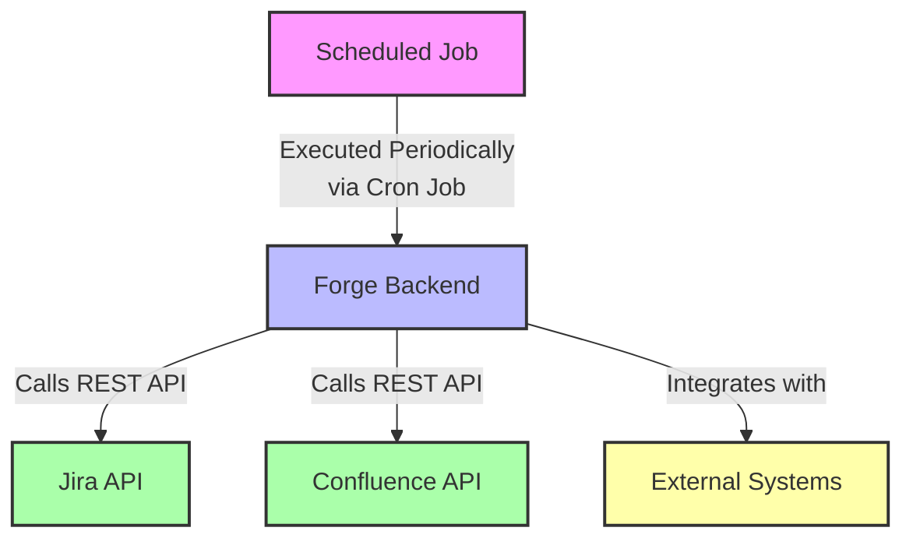

# Scheduled Jobs

:::tip Compatibility

This module is available for both the **Jira** and **Confluence** versions of the app.

:::

## Overview

Scheduled Jobs are [Forge backend JavaScript functions](../forge-bridge-back/index.md) allow you to automate tasks and workflows in **Jira** and **Confluence**. These jobs enable you to run scripts at regular intervals to perform a variety of actions, such as:

- **Syncing data between systems**
- **Creating and updating content**
- **Generating reports**
- **Sending emails**
- **Cleaning outdated content** (e.g., deleting inactive users)  
- And much more.

## Key Benefits
Scheduled Jobs are particularly useful for creating seamless integrations between your Atlassian cloud applications and external systems. By automating repetitive tasks, you can:

- Save administrators time by reducing manual intervention.
- Maintain consistent workflows across your environment.
- Streamline operations for enhanced efficiency.

## Configuring Scheduled Jobs
Scheduled Jobs can be configured to run automatically at specific intervals using a **cron expression**. This enables you to schedule recurring tasks, ensuring your processes stay on track without needing continuous oversight.

By leveraging Scheduled Jobs, you can build robust, automated solutions tailored to your organization’s unique needs in Jira and Confluence.

## Limitations

Scheduled Jobs utilize the [Forge Async Events API](https://developer.atlassian.com/platform/forge/runtime-reference/async-events-api/) under the hood and therefore inherit its limitations. Keep these points in mind when designing your scripts:

### 1. Execution Time Limit
Scheduled Jobs have a maximum execution time of **55 seconds**. If a task exceeds this limit:
- It will fail silently.
- The failure will not appear in the job history.

### 2. Execution Timing
While you can specify an exact execution time for a scheduled job, execution is **not guaranteed to occur precisely at the scheduled time**. Tasks may experience delays of up to **60 minutes** in most cases.

### 3. Task Execution Order
The execution of tasks is queued, and workers consume tasks in **no predefined order**. As a result:
- Execution time cannot be guaranteed to be consistent for each interval (e.g., the task may not execute at the same time every hour).
- Variability in execution order may impact workflows relying on precise timing.

---

### Recommendations
When designing **time-sensitive** or **long-running** tasks, consider the following:
- **Break Down Large Tasks**: Divide long-running processes into smaller, manageable tasks.
- **Account for Delays**: Build flexibility into workflows to handle potential timing deviations.
- **Monitor and Log**: Implement logging mechanisms to track task status and handle silent failures proactively.
- **Adapt to Variability**: Avoid relying on strict timing guarantees for tasks that must execute at predictable intervals.

Understanding these limitations will help you design more reliable and robust scheduled jobs for your application.
