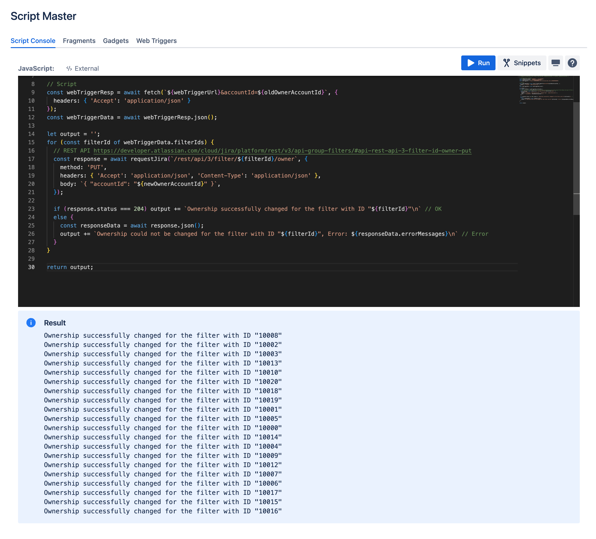

# Jira Example: Transfer the ownership of all filters from one use to another

:::tip Compatibility

This example for **Jira** version of [Script Console](./index.md).

:::

This example demonstrates how to transfer complete ownership of all filters from one user to another.

Unfortunately, it is not possible to implement such a script solely in Script Console because the [search filters REST API has a number of limitations](https://developer.atlassian.com/cloud/jira/platform/rest/v3/api-group-filters/#api-rest-api-3-filter-search-get), and allows only access to:
- Filters shared with a group that the current user is a member of
- Filters shared with a private project that the current user has Browse projects permission for
- Filters shared with a public project
- Filters shared with the public

This means that as an administrator, you may not meet some of the requirements and will not be able to change all the filters. To solve this problem, there is a workaround: use [Web Triggers](../web-triggers/) which can act with "asApp" permissions and access all shared filters.

## Step 1: Create a Web Triggers Script

Create a [Web Triggers](../web-triggers/) script:

```javascript
/* This Web Trigger returns the filterIds of all filters owned by the accountId specified in the query parameters */

const getFiltersRecursive = async (filters, query) => {
    const allQueryParams = { startAt: 0, maxResults: 50, ...query };
    const { startAt, maxResults } = allQueryParams;
    // REST API https://developer.atlassian.com/cloud/jira/platform/rest/v3/api-group-filters/#api-rest-api-3-filter-search-get
    const filterSearchResponse = await api.asApp().requestJira(route`/rest/api/3/filter/search?${new URLSearchParams(allQueryParams).toString()}&expand=owner`, {
        headers: { 'Accept': 'application/json' }
    });
    const filterSearchData = await filterSearchResponse.json();
    if (filterSearchResponse.status !== 200) throw new Error(filterSearchData.errorMessages);
    return filterSearchData.isLast
        ? [...filters, ...filterSearchData.values]
        : await getFiltersRecursive([...filters, ...filterSearchData.values], { ...allQueryParams, startAt: startAt + maxResults });
}

const accountId = request.queryParameters.accountId[0];
const filters = await getFiltersRecursive([], { accountId: accountId });
const filterIds = filters.filter(filter => filter.owner.accountId === accountId).map(filter => filter.id);

return ({
    body: JSON.stringify({
        filterIds: filterIds,
    }),
    headers: {
        'Content-Type': ['application/json'],
    },
    statusCode: 200,
    statusText: 'OK'
});
```


## Step 2: Prepare a Script Console Script

Prepare a [Script Console](./index.md) script and fill in all the configuration variables, including the Web Trigger URL from Step 1.

```javascript
/* Change the ownership of all filter from one user (oldOwnerAccountId), to another (newOwnerAccountId) */

// Configuration variables
const oldOwnerAccountId = '0000000[{-_-}]Zzz0000000';
const newOwnerAccountId = '0000000【ツ】0000000';
const webTriggerUrl = 'https://00000000000.hello.atlassian-dev.net/x1/0000000000000';

// Script
const webTriggerResp = await fetch(`${webTriggerUrl}&accountId=${oldOwnerAccountId}`, {
  headers: { 'Accept': 'application/json' }
});
const webTriggerData = await webTriggerResp.json();

let output = '';
for (const filterId of webTriggerData.filterIds) {
  // REST API https://developer.atlassian.com/cloud/jira/platform/rest/v3/api-group-filters/#api-rest-api-3-filter-id-owner-put
  const response = await requestJira(`/rest/api/3/filter/${filterId}/owner`, {
    method: 'PUT',
    headers: { 'Accept': 'application/json', 'Content-Type': 'application/json' },
    body: `{ "accountId": "${newOwnerAccountId}" }`,
  });

  if (response.status === 204) output += `Ownership successfully changed for the filter with ID "${filterId}"\n` // OK
  else {
    const responseData = await response.json();
    output += `Ownership could not be changed for the filter with ID "${filterId}", Error: ${responseData.errorMessages}\n` // Error
  }
}

return output;
```

## Result

As a result, we have a Script Console example that allows you to automatically transfer ownership of all the filters from one user to another.

Results example:
