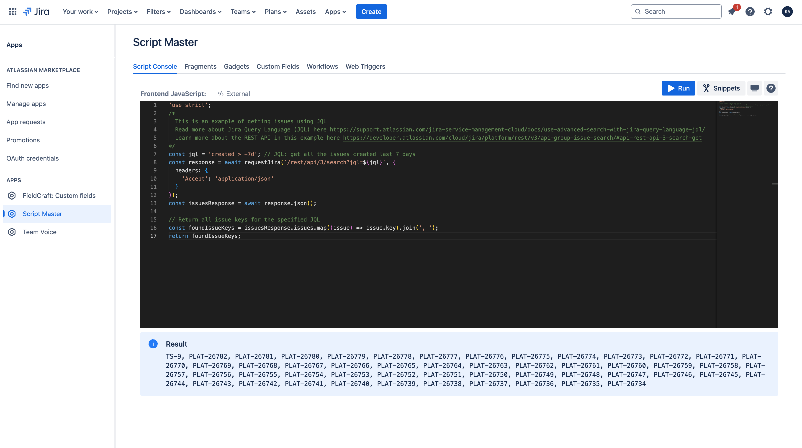
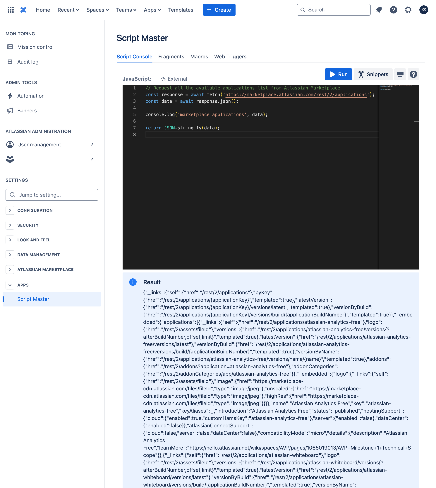
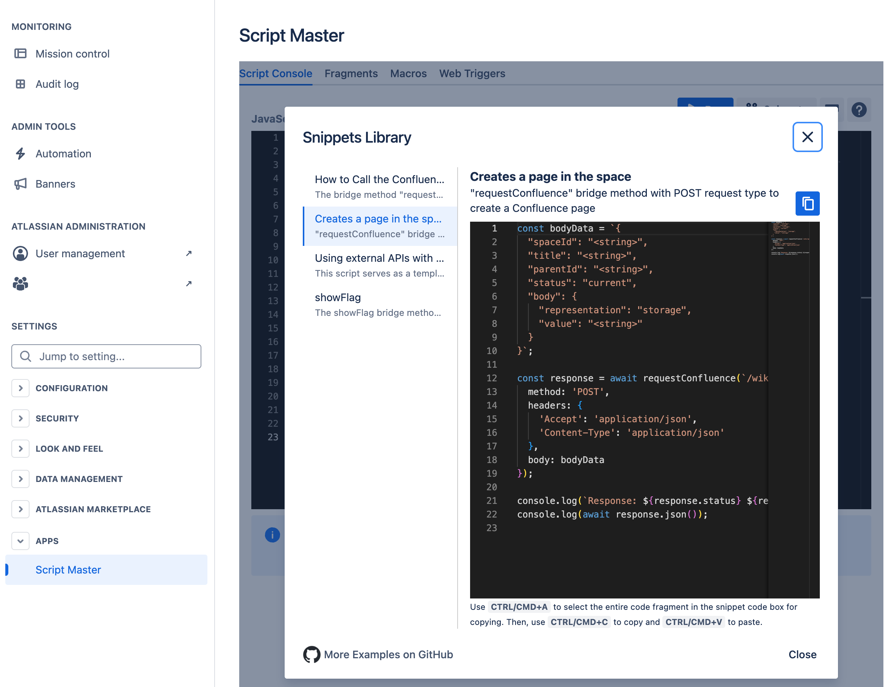

# Script Console

:::tip Compatibility

This module is available for both the **Jira** and **Confluence** versions of the app.

:::

## Overview

The Script Console is a tool for executing ad hoc scripts and experimenting with the Jira or Confluence REST API and Forge-compatible scripts. You can input scripts directly into the Script Console editor and run them with your current permissions. It's useful for displaying information, performing one-off cleanup tasks, and bulk updating various Jira or Confluence elements. For instance, as an admin, you can swiftly change the ownership of multiple filters or dashboards in Jira and spaces in Confluence in bulk, rather than manually searching for and updating the owner of each one individually.

## Getting Started with Script Console

1. Open the **Script Console** tab from the **Script Master** menu.
2. Follow the on-screen instructions to write and execute your script.

import Tabs from '@theme/Tabs';
import TabItem from '@theme/TabItem';

<Tabs>
  <TabItem value="jira" label="In Jira version" default>
    
  </TabItem>
  <TabItem value="conf" label="In Confluence version">
    
  </TabItem>
</Tabs>

We are using a powerful code editor, which will assist you in writing code more efficiently. [Read more about Code Editor features, shortcuts, and more](../code-editor/index.md).

## Context

The Script Console runs all scripts in the context of the current user, adhering to their permissions. This means it cannot read or modify any content that the current user does not have access to. You can use JavaScript to perform external `fetch` calls and employ special bridge methods for seamless interaction between your script and Jira/Confluence.

To output relevant information, use `console.log()` or the `return` statement at the end of your script. For more insights and examples, refer to the 'Snippets Library' directly inside the app.

Because Script Console implements Forge Custom UI, you can utilize all [Forge bridge APIs from Custom UI](../forge-bridge-front/index.md). Among the most useful are `view`, `requestConfluence`, `requestJira`.

## Snippets Library

The in-app Snippets Library consists of various script examples that will help you get started with building amazing scripts. It explains the basics of getting data from the Application REST API and sending POST/PUT requests, making it easier to automate and customize your cloud instance.

<Tabs>
  <TabItem value="jira" label="In Jira version" default>
    
  </TabItem>
  <TabItem value="conf" label="In Confluence version">
    
  </TabItem>
</Tabs>

How to use examples from the Snippet Library:

## Examples

### Jira 

- [Bulk Clone Issues](./example-bulk-clone-issues.md). The script for the Scripted Console in Jira clones up issues based on a specified JQL.
- [Change the owner of multiple filters](./example-change-filters-owner.md). Change the ownership of multiple filters, identified by their IDs , to another user.
- [Change the ownership of all filters from one use to another](./example-transfer-filters-ownership.md). This example demonstrates how to transfer complete ownership of filters from one user to another.
- [Create issue](./example-create-issue.md). This script saves time and effort by automating the issue creation process.

### Confluence

- [Permanently purge trashed pages from multiple Confluence spaces](example-purge-trashed-pages.md). This script allows you to permanently delete trash from multiple Confluence spaces. Be aware that this action is irreversible; once the trash is emptied, the content cannot be recovered.

<!-- import Example1 from './_example.md';

<Example1 /> -->
