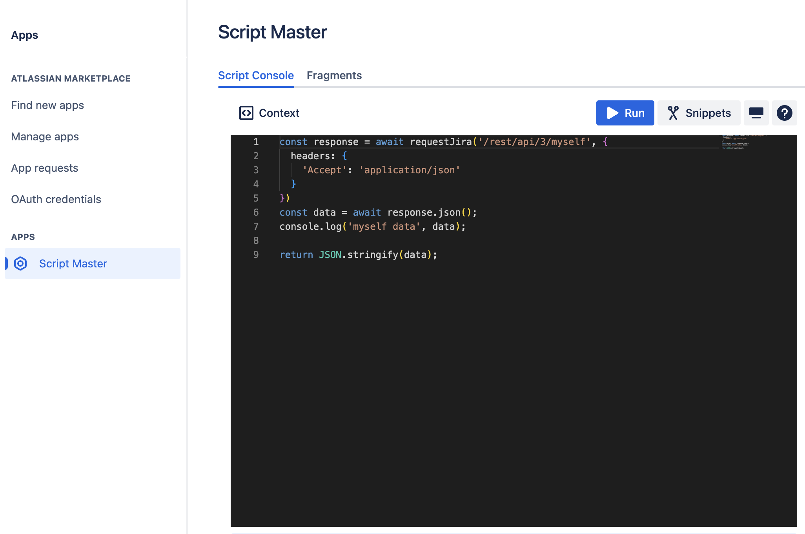
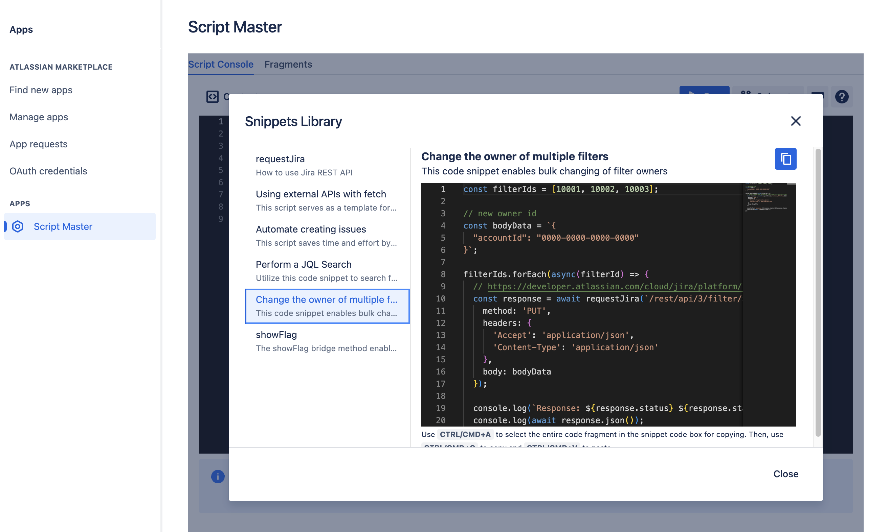

# Script Console

:::tip Compatibility

This module is available for both the Jira and Confluence versions of the app.

:::

## Overview
The Script Master provides a tool for executing ad hoc scripts and experimenting with the Jira or Confluence REST API and Forge-compatible scripts. You can input scripts directly into the Script Console editor and run them with your current permissions. It's useful for displaying information, performing one-off cleanup tasks, and bulk updating various Jira or Confluence elements. For instance, as an admin, you can swiftly change in bulk the ownership of multiple filters or dashboards in Jira and spaces in Confluence, rather than manually searching and updating the owner of each one individually.

## Getting Started with Script Console

1. Open the **Script Console** tab from the **Script Master** menu.
2. Follow the on-screen instructions to write and execute your scripts.

import Tabs from '@theme/Tabs';
import TabItem from '@theme/TabItem';

<Tabs>
  <TabItem value="jira" label="In Jira version" default>
    
  </TabItem>
  <TabItem value="conf" label="In Confluence version">
    TBD
    <!--  -->
  </TabItem>
</Tabs>

## Context

The Script Console runs all scripts in the context of the current user, adhering to their permissions. This means it cannot read or modify any content that the current user does not have access to. You can use JavaScript to perform external `fetch` calls and employ special bridge methods for seamless interaction between your script and Jira/Confluence.

To output relevant information, use `console.log()` or the `return` statement at the end of your script. For more insights and examples, refer to the 'Snippets Library' directly inside the app.

## Forge bridge APIs

The Forge bridge API is a JavaScript API that enables custom UI modules to securely integrate with Atlassian products.

- [`events`](https://developer.atlassian.com/platform/forge/apis-reference/ui-api-bridge/events/) The Events API allows your app to manage event subscriptions and emissions, facilitating communication between different Custom UI extensions within the same app. You can subscribe to events - Register to listen for specific events.
Unsubscribe from events - Remove a previously registered event listener.
Emit events - Trigger events to notify other parts of your app.

- [`Modal`](https://developer.atlassian.com/platform/forge/apis-reference/ui-api-bridge/modal/) The Modal class enables your custom UI app to open a modal dialog. You can specify the resource that will be displayed within this modal.

- [`requestConfluence`](https://developer.atlassian.com/platform/forge/apis-reference/ui-api-bridge/requestConfluence/) The requestConfluence bridge method allows Forge apps to interact with the Confluence Cloud platform REST API on behalf of the current user. [Confluence REST API](https://developer.atlassian.com/cloud/confluence/rest/v2).

- [`requestJira`](https://developer.atlassian.com/platform/forge/apis-reference/ui-api-bridge/requestJira/) The requestJira bridge method allows Forge apps to interact with the Jira Cloud platform REST API on behalf of the current user. [Jira REST API](https://developer.atlassian.com/cloud/jira/platform/rest/v3/intro).

- [`router`](https://developer.atlassian.com/platform/forge/apis-reference/ui-api-bridge/router/) The router object provides navigation capabilities within the host product, allowing you to programmatically direct users to different pages.

- [`showFlag`](https://developer.atlassian.com/platform/forge/apis-reference/ui-api-bridge/showFlag/) The showFlag bridge method allows your custom UI apps to display notification flags within the product's flag group.

- [`view`](https://developer.atlassian.com/platform/forge/apis-reference/ui-api-bridge/view/) The view object represents the context in which a resource is loaded, such as within a modal dialog. This context provides relevant information and methods for managing the resource.

## Snippets Library

The in-app Snippets Library consists of various script examples that will help you get started with building amazing scripts. It explains the basics of getting data from the Jira REST API and sending POST/PUT requests, making it easier to automate and customize your Jira instance.

<Tabs>
  <TabItem value="jira" label="In Jira version" default>
    
  </TabItem>
  <TabItem value="conf" label="In Confluence version">
    TBD
  </TabItem>
</Tabs>

:::note

[More Examples on GitHub](https://github.com/kaisersoftapps/script-master)

:::