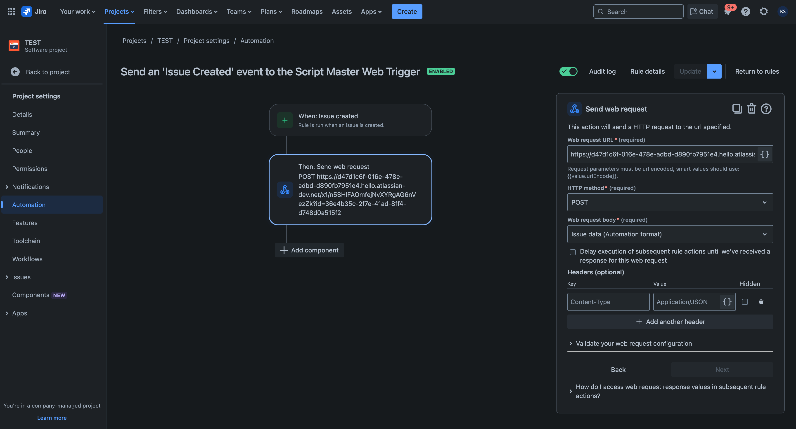

# Automation Integration

:::tip Compatibility

This example both for **Jira** and **Confluence** versions of [Web Triggers](./index.md).

:::


## Overview

Script Master doesn't have a built-in module to listen for product events like **"Issue created"** or **"Issue updated"**. However, administrators can achieve this behavior by using a **scripted listener**, which processes such events via a combination of **Automations** and [Web Triggers](./index.md).

This example shows how to create a listener that watches for the **"Issue created"** event and automatically adds labels to the newly created issues. Based on this template, you can implement other scripted listeners using:

- [Jira Automation](https://support.atlassian.com/cloud-automation/docs/jira-cloud-automation/)
- [Confluence Automation](https://support.atlassian.com/confluence-cloud/docs/what-is-confluence-automation/)

**The process consists of 2 steps:**
1. Create a new Web Trigger  
2. Create Jira Automation


## Step 1: Create a New Web Trigger

Go to **Script Master → Web Triggers**, and click **"Create Web Trigger"**.  
Give your trigger a meaningful name, and use the example code below as a starting point:


```js
/* no import needed, 'api', 'route', 'fetch', 'authorize', 'request' already available as global variables */

if (!request.body) return ({ body: 'request.body is empty', statusCode: 202 });

// Retrieve issue details from the request
const requestBody = JSON.parse(request.body);
const issueKey = requestBody.key;
const issueSummary = requestBody.fields.summary;

// Update the issue accordingly
const bodyData = {
  fields: {
    summary: issueSummary + ' UPDATED'
  }
};
const response = await api.asApp().requestJira(route`/rest/api/3/issue/${issueKey}`, {
  method: 'PUT',
  headers: {
    'Accept': 'application/json',
    'Content-Type': 'application/json'
  },
  body: JSON.stringify(bodyData)
});

// Return a successful Web Trigger response
return ({
    body: 'ok',
    statusCode: 200
});
```

This script retrieves information about the current issue and updates its summary. You can modify it to make any other changes to the issue as needed.

Here is an example of the `request` object that comes from the Automation Rule (web request):

```json
{
  "method": "POST",
  "headers": {
    "host": [
      "14fd1c6f-016e-478e-adbd-d890f33951e1.hello.atlassian-dev.net"
    ],
    "content-length": [
      "10633"
    ],
    "accept": [
      "application/json; charset=UTF-8, */*;q=0.8"
    ],
    "content-type": [
      "application/json"
    ],
    "user-agent": [
      "Automation for Jira AC app/1.0;15c345eb-1c62-49c6-9384-414071458ea1"
    ]
    // other headers
  },
  "queryParameters": {
    "id": [
      "36edf35c-2f7e-41ad-8ff4-d748d0a515f2"
    ]
  },
  "body": {
    "self": "https://one-atlas-forge.atlassian.net/rest/api/2/65356",
    "id": 65356,
    "key": "TEST-4",
    "changelog": {
      "startAt": 0,
      "maxResults": 0,
      "total": 0,
      "histories": null
    },
    "fields": {
      "summary": "Test summary",
      "customfield_10001": null,
      "customfield_10002": null
      // other fields involved
    }
  }
}
```

:::tip Web Trigger return object  
Don't forget to always return an object with `statusCode: 200`, or both the Web Trigger and Automation executions will be marked as failed.  
:::

Once the title and script are created, save the Web Trigger. It will generate a unique URL.

If you try to open this URL in a browser, you'll see a plain text message:  
`request.body is empty`  
This is an expected response — it means the Web Trigger is working, but no request body was sent, so the trigger doesn't perform any actions.

📌 **Artifact of this step:** Copy the Web Trigger's URL to use later in the automation setup.


## Step 2: Create Jira Automation

Open **Automation** in any project you'd like to integrate with the scripted Web Trigger (or use **Global Automation** if needed).  
Create a new automation rule with the following setup:

1. **Trigger**: Choose `"Issue created"` (or another event you want to react to).
2. **Action**: Add `"Send web request"` and configure the fields as follows:

- **Web request URL**: Paste the Web Trigger URL from Step 1.  
- **HTTP method**: `POST` (required to send issue data).  
- **Web request body**: Select `"Issue data (Automation format)"` to send all issue fields.  
- Leave other fields with their default values.

Example:  


Enable and save the automation rule.


## Test Integration

With both the Web Trigger and Jira Automation rule created, enabled, and saved, you can test the integration by creating a new issue in the project.

Within a few seconds of issue creation, the script will run and update the **Summary** field by appending `"Updated"` to it.


## Logging and Debugging

- **Automation logs**:  
  Successful executions appear under **Automation → Audit log**.  
  If the rule fails, you'll see a **"Some errors"** status — click **"Show more"** for details.

- **Web Trigger logs**:  
  Execution logs are only visible if the script contains `console.log` statements or the script fails during execution.

