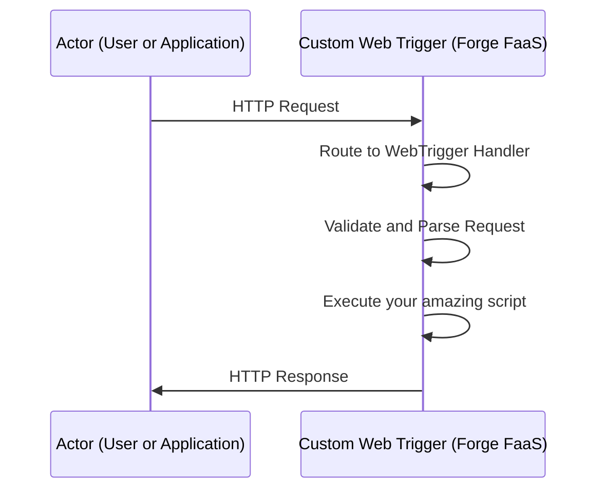

# Web Triggers

:::tip Compatibility

This module is available for both the **Jira** and **Confluence** versions of the app.

:::

Web Triggers are JavaScript functions running on the Forge back end that respond to HTTP requests. They enable seamless integration between your Jira or Confluence instances and external systems without requiring user authentication. 

In Script Master, Web Triggers serve as an extension of [Forge Web Trigger](https://developer.atlassian.com/platform/forge/manifest-reference/modules/web-trigger/).

## Setting Up Web Triggers

1. Go to the **Web Triggers** tab from the **Script Master** page.
2. Create a new web trigger by writing a JavaScript function.
3. Save the web trigger to generate a unique URL.
4. Use this URL to handle HTTP requests.

We are using a powerful code editor, which will assist you in writing code more efficiently. [Read more about Code Editor features, shortcuts, and more](../code-editor/index.md).

import Tabs from '@theme/Tabs';
import TabItem from '@theme/TabItem';

<Tabs>
  <TabItem value="jira" label="In Jira version" default>
    
  </TabItem>
</Tabs>

## Context

Web Triggers implement Forge backend FaaS function, allowing you to utilize all [Bridge API for Forge backend FaaS function](../forge-bridge-back/index.md). Among the most useful are `api` and `request`.

## Best Practices

- **Security Considerations**: Validate incoming requests and perform authorized actions within Jira or Confluence applications to ensure security.
- **Error Handling**: Implement robust error handling to ensure reliable trigger operation.
- **Performance Optimization**: Optimize trigger performance for minimal latency and improved responsiveness.

## Key Features

- **No User Authentication Required**: Accessible via a unique URL, allowing external systems to communicate with Jira or Confluence seamlessly.
- **Communication with Jira**: Interact with application using the `useApp()` method, enabling actions such as issue creation, updates, and workflow triggers.
- **Scalability and Reliability**: Benefit from Forge platform's scalability and reliability for handling a large volume of requests.

## Use Cases

- **Integrating with External Systems**: Integrate Jira or Confluence with third-party applications or internal tools for seamless data synchronization.
- **Automating Workflows**: Trigger actions based on specific events or conditions to streamline processes and improve productivity.
- **Extending Functionality**: Enhance functionality of Jira or Confluence with custom actions or behaviors to meet organizational needs.

## Examples

- [Authorization](./example-authorization.md). Example of adding a check for an "authorization" header in the request and validate any provided token.
