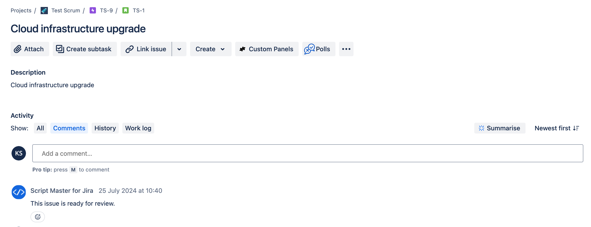

# Add a Comment to an Issue

Let's create a post-function that adds a comment to an issue when it transitions to some status. 
For example, when tasks move to the review status, automatically add a predefined comment to notify reviewers that they are ready for review or approval.

Steps:

1. Draft your project workflow. You can view it in Text or Diagram mode.
2. Select the transition you want to run the post function for, such as the Review transition.
3. On the Transition page, go to the Post Functions tab and select Add Post Function.
4. Choose "Scripted post-function" and click Add.
5. Modify the example script as needed.
6. Click Add at the bottom of the page.
7. Click Publish Draft at the top of the page.


```javascript
const bodyData = `{
  "body": {
    "content": [
      {
        "content": [
          {
            "text": "This issue is ready for review.",
            "type": "text"
          }
        ],
        "type": "paragraph"
      }
    ],
    "type": "doc",
    "version": 1
  }
}`;

await api.asApp().requestJira(route`/rest/api/3/issue/${payload.issue.id}/comment`, {
  method: 'POST',
  headers: {
    'Accept': 'application/json',
    'Content-Type': 'application/json'
  },
  body: bodyData
});
```

As a result, when an issue is moved using this transition, a comment will be added to the issue on behalf of the app.

