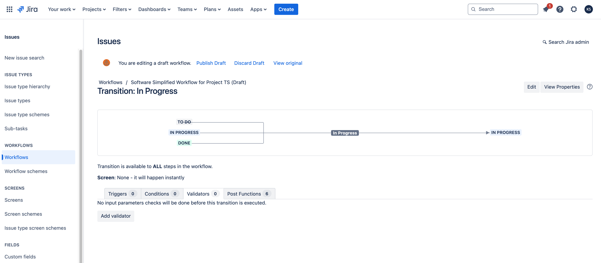
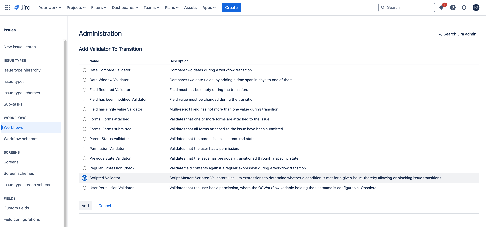
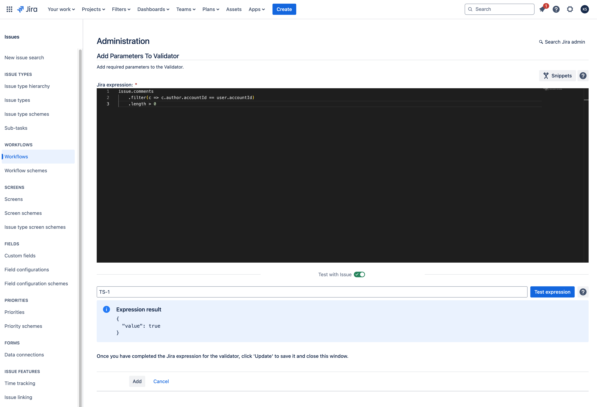

# Workflow Validators

:::tip Compatibility

This module available in Script Master for **Jira** only.

:::


## Overview 

A Scripted Validator in the context of Script Master for Jira is a type of custom validator that allows you to write and execute [Jira Expressions](https://developer.atlassian.com/cloud/jira/platform/jira-expressions/) to validate issues during transitions in Jira workflows. Unlike standard validators that rely on predefined rules, Scripted Validators provide a flexible and powerful way to implement complex validation logic tailored to specific needs.

Here's a brief summary of the key points about Scripted Validators:

- Customization: Scripted Validators enable you to create custom validation logic using [Jira Expressions](https://developer.atlassian.com/cloud/jira/platform/jira-expressions/). This allows for more sophisticated and granular control over issue validation than standard validators.
- Integration: They integrate directly into Jira workflows, so you can specify when and where the custom validation should occur, such as during issue transitions.
- Error Handling: If the validation fails, the script can provide custom error messages to guide users on what needs to be corrected.
- Flexibility: You can use scripted validators to check a wide range of conditions, including complex business rules and data integrity checks, which go beyond the capabilities of standard Jira validators.

Overall, Scripted Validators offer a robust solution for implementing advanced validation scenarios in Jira workflows.

Scripted Validators implements [Forge Jira workflow validator module](https://developer.atlassian.com/platform/forge/manifest-reference/modules/jira-workflow-validator/). 


## Context

[Jira Expressions](https://developer.atlassian.com/cloud/jira/platform/jira-expressions/) use JavaScript-like syntax. They support a subset of JavaScript constructs and features, here is a brief overview of some of the main ones 

- `user` (User): The user the condition is evaluated for.
- `issue` (Issue): The issue selected for the transition.
- `project` (Project): The project the issue belongs to.
- `transition` (Transition): The transition that the condition is being evaluated against.
- `workflow` (Workflow): The workflow that contains the condition.


## Configuration

Screenshots:





All available scripted extensions will be displayed in the 'Workflow' section of the Script Master:


## Examples

### Allowed Issue Types

Transition is permitted only if the issue type is included in the allowed list.

```javascript
['Bug', 'Task'].includes(issue.issueType.name)
```

### Current User Comment Verification

Transition is allowed only if the issue has a comment from the current user.

```javascript
issue.comments
  .filter(c => c.author.accountId == user.accountId)
  .length > 0
```