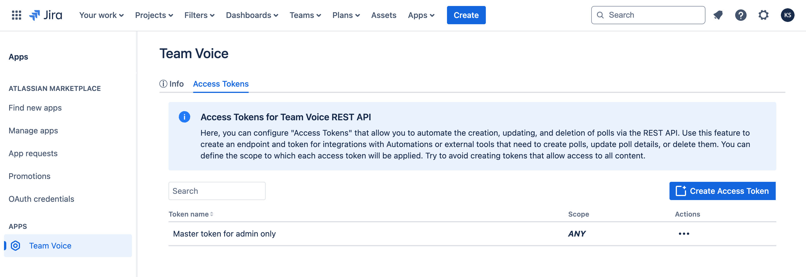

# Access Tokens

:::warning

The REST API is still in beta and is subject to change.

:::

## Generating Access Tokens for the REST API

To use the [Polls REST API](../rest-api/index.md) for creating, updating, and deleting polls, you need to configure "Access Tokens". These tokens enable you to automate these actions and integrate with automation tools or external systems.

### Steps to Generate an Access Token

1. **Navigate to Access Tokens Configuration**:
   - Go to Team Voice settings to manage access tokens.

2. **Create a New Access Token**:
   - Select the option to create a new token.
   - Provide a descriptive name for the token, indicating its purpose (e.g., "Poll Management Token for Automation").

3. **Define the Scope**:
   - Set the scope of the token to limit its access to only the necessary content and actions. Avoid creating tokens that allow unrestricted access to all content.
   - For example, you might restrict the token to only allow operations related to polls within specific Jira projects or Confluence spaces.

4. **Generate and Save the Token**:
   - After defining the scope, generate the token.
   - Copy and securely store the token. You will need it to authenticate your API requests.

### Using the Access Token

When making API requests, include the access token as a query parameter to authenticate your actions. The token ensures that your API calls are authorized to perform the specified operations.

Example:

https://12309651-8def-4d6b-aadc-d2e843273d1d.hello.atlassian-dev.net/x1/xs1i2ODeo611kO3x4adU6sCYcqM?token=3121ebe7-2d97-4fd9-b8ee-4a1725c9f337

### Best Practices

- **Scope Limitation**: Always limit the scope of your access tokens to the minimum required for your integrations.
- **Token Security**: Keep your access tokens secure. Do not share them or expose them in public repositories or unsecured locations.
- **Regular Review**: Periodically review and revoke tokens that are no longer needed or are suspected to be compromised.

By following these guidelines, you can securely automate and [manage polls using the REST API](../rest-api/index.md).
